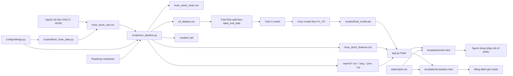
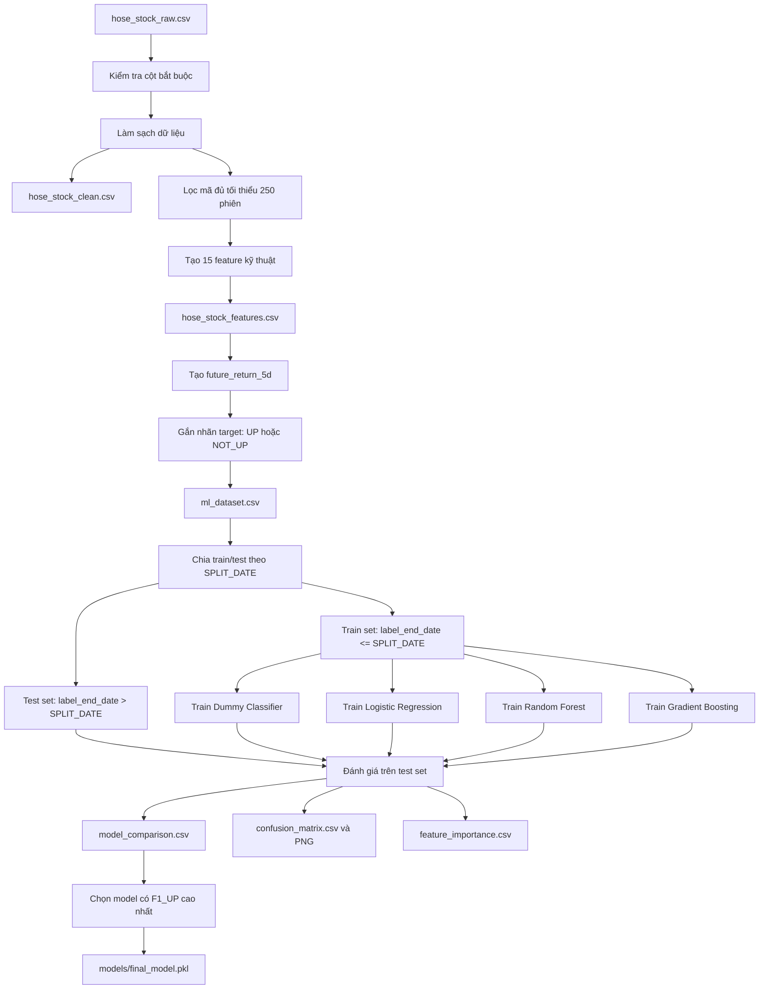
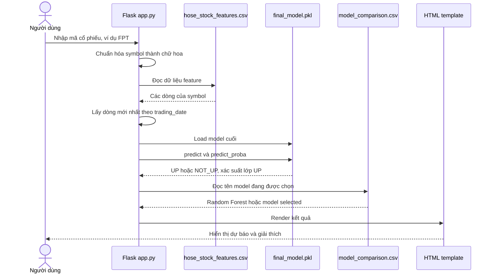
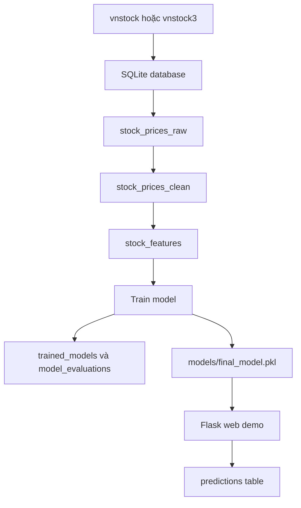

# Sơ đồ kiến trúc hệ thống dự báo xu hướng cổ phiếu HOSE

Tài liệu này được tổng hợp từ code hiện tại và roadmap của project.

## 1. Kiến trúc tổng thể hiện tại



### Cách đọc sơ đồ

- `hose_stock_raw.csv` là dữ liệu OHLCV gốc.
- `fetch_hose_data.py` dùng `vnstock` để cập nhật thêm dữ liệu mới vào raw CSV.
- `run_pipeline.py` là phần xử lý chính: làm sạch, tạo feature, tạo nhãn, train model, đánh giá, xuất report.
- `final_model.pkl` là model cuối được web sử dụng.
- `app.py` là Flask backend, nhận mã cổ phiếu từ người dùng và trả kết quả `UP / NOT_UP`.
- `templates/` và `static/` là phần giao diện web.

## 2. Pipeline xử lý dữ liệu và train model



### Ý chính

Pipeline không train trực tiếp từ file raw. Nó đi qua nhiều bước:

```text
raw data
→ cleaned data
→ feature data
→ ML dataset có target
→ train/test split
→ train model
→ evaluate
→ final_model.pkl
```

`ml_dataset.csv` chứa cả train và test. Code chia train/test trong RAM bằng `label_end_date`:

```text
Train: label_end_date <= SPLIT_DATE
Test : label_end_date > SPLIT_DATE
```

Theo code hiện tại:

```text
SPLIT_DATE = 2025-12-31
```

Theo report hiện tại:

```text
Train: 2019-10-23 đến 2025-12-31
Test : 2026-01-05 đến 2026-05-29
```

## 3. Luồng dự báo trên web



### Ý chính

Khi chạy web, hệ thống không train lại model. Web chỉ:

1. Đọc feature đã xử lý.
2. Lấy dòng mới nhất của mã cổ phiếu.
3. Load `final_model.pkl`.
4. Dự báo `UP / NOT_UP`.
5. Hiển thị xác suất lớp `UP` nếu model hỗ trợ.

## 4. Các thành phần chính và vai trò

| Thành phần | Vai trò |
|---|---|
| `config/settings.py` | Cấu hình đường dẫn, feature, model, split date, threshold |
| `scripts/fetch_hose_data.py` | Cập nhật dữ liệu OHLCV mới bằng `vnstock` và append vào raw CSV |
| `scripts/run_pipeline.py` | Pipeline chính: clean, feature, label, train, evaluate |
| `scripts/train_tune_models.py` | Tune LogReg, RF, GB với TimeSeriesSplit(gap=5) |
| `data/processed/hose_stock_clean.csv` | Dữ liệu OHLCV đã làm sạch |
| `data/processed/hose_stock_features.csv` | Dữ liệu có 15 feature (metadata web, DB sync) |
| `data/processed/ml_dataset.csv` | Dữ liệu có feature + target, dùng để train/test |
| `models/final_model.pkl` | Model cuối cùng đang triển khai |
| `reports/model_comparison.csv` | Bảng so sánh 4 model |
| `reports/confusion_matrix.csv` | Bảng đúng/sai của final model |
| `reports/feature_importance.csv` | Mức độ quan trọng của feature |
| `app.py` | Flask backend |
| `templates/index.html` | Trang nhập mã và xem dự báo |
| `templates/evaluation.html` | Trang xem bảng đánh giá model |
| `static/style.css` | Giao diện CSS |

## 5. Kiến trúc theo roadmap và trạng thái hiện tại

Roadmap đề xuất kiến trúc đầy đủ hơn:



Code hiện tại:

| Phần trong roadmap | Trạng thái hiện tại |
|---|---|
| Fetch dữ liệu bằng `vnstock` | Đã có `scripts/fetch_hose_data.py` |
| SQLite database | Chưa có trong code hiện tại |
| Lưu raw/clean/features vào database | Hiện lưu bằng CSV |
| Train nhiều model | Đã có |
| Chọn model tốt nhất theo `F1_UP` | Đã có |
| Lưu `final_model.pkl` | Đã có |
| Web Flask demo | Đã có |
| Lưu lịch sử predictions | Chưa thấy trong code hiện tại |

## 6. Sơ đồ một câu

```text
vnstock/raw CSV
→ làm sạch dữ liệu
→ tạo feature
→ tạo nhãn UP/NOT_UP
→ chia train/test theo thời gian
→ train và đánh giá model
→ chọn Random Forest làm final model
→ Flask web dùng final_model.pkl để dự báo mã người dùng nhập
```

