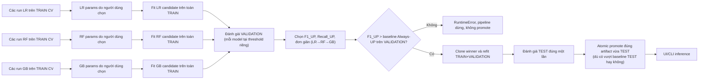

# Giải thích project dự báo xu hướng cổ phiếu HOSE

Tài liệu hiện hành cho policy ML `rolling_recent_cv_oof_threshold` (hằng số `EXPERIMENT_POLICY_ID` trong `config/settings.py`).

> Trạng thái: artifact và metric đang phục vụ (`models/final_model.pkl`, `models/model_metadata.json`) là một artifact **legacy**, không phải sản phẩm của policy hiện hành. Final Model hiện tại là **Random Forest**, có `policy_id = "legacy_pre_validation_baseline_gate"` (khác `EXPERIMENT_POLICY_ID` của code hiện tại), và **chưa vượt baseline** trên cả VALIDATION lẫn TEST. Artifact này được import một lần vào `experiments/evaluation_registry.json` (ghi chú `"Imported prior TEST evaluation without re-evaluation."`), không chạy qua `select_final_model()` hiện hành — nếu chạy qua code hiện tại, việc trượt baseline VALIDATION sẽ làm pipeline dừng bằng lỗi (xem mục 8), không cho ra artifact như hiện tại. Đây là số liệu và tình trạng thật, không phải giả định. Vì `policy_id` không khớp, trang `/evaluation` hiện hiển thị view legacy (bảng `model_comparison.csv` cũ kèm banner cảnh báo), không phải view policy hiện hành mô tả ở mục 11.3.
>
> Một dấu vết khác của "legacy": `build_model_metadata()` hiện tại **có** ghi hai field `training_symbols` và `training_symbol_count` (danh sách mã đã thực sự góp row vào lúc train), nhưng metadata legacy đang serve thì **không có** hai field đó. Vì vậy chatbot phải lùi về `reports/eligible_symbols.csv` và phát warning `symbol_scope_unverified` (mục 11).
>
> **Nhưng cổng chạy pipeline sạch đang MỞ.** Dataset trên đĩa đã được refresh sau lần release legacy đó, và ba cấu hình trong `experiments/manual_config.json` đã được chốt lại đúng trên snapshot mới. Số kiểm bằng chính code (`compute_dataset_fingerprint()`, `compute_experiment_fingerprint()`, `is_config_complete()`, `has_evaluated_snapshot()`):
>
> ```text
> ml_dataset.csv hiện tại   513.971 row, 396 mã, 2019-10-23 → 2026-07-24
> tuning_fingerprint  live  fa1cf401b4a6   == manual_config.json  →  is_config_complete() = True
> experiment_fingerprint    41580ec734ea   CHƯA có trong evaluation_registry.json  →  TEST còn nguyên
> registry chỉ có           fd7fa2887812   (snapshot legacy, status "published")
> lock                      pipeline.lock / fetch.lock / tuning.lock đều không tồn tại
> ```
>
> Nghĩa là 5 điều kiện `can_run` ở mục 11 đều thỏa: có thể bấm "Chạy official pipeline" ngay để sinh một release **thuộc policy hiện hành**, thay cho artifact legacy. Tài liệu này mô tả cả hai trạng thái — số của release legacy (nằm trong `reports/` + `models/`) và số của dataset đang chờ chạy (đọc trực tiếp từ `data/processed/ml_dataset.csv`) — nên khi trích số vào báo cáo, phải nói rõ đang trích cột nào.

## 0. Bản đồ nhanh (đọc mục này trước)

Một câu về project: đọc OHLCV lịch sử HOSE ngoại tuyến → tạo 20 feature + nhãn "tăng > 1% sau đúng 5 phiên" → tuning 3 model bằng CV có purge → chọn 1 model trên VALIDATION → test một lần trên TEST → phục vụ dự báo qua web Flask + chatbot.

Luồng dữ liệu, một dòng:

```text
CSV thô  →  clean  →  20 feature + nhãn t+5  →  ml_dataset.csv
        →  split TRAIN / VALIDATION / TEST (rolling theo phiên cuối)
        →  CV 4 fold trên TRAIN + chọn ngưỡng OOF   (Tuning Lab)
        →  chọn 1 winner trên VALIDATION            (cổng baseline, dừng nếu trượt)
        →  refit TRAIN+VALIDATION, test 1 lần trên TEST
        →  atomic promote final_model.pkl            →  UI + chatbot
```

Thư mục cần biết:

| Đường dẫn | Vai trò |
| --- | --- |
| [config/settings.py](../config/settings.py) | mọi hằng số: policy id, ngày fallback, 20 feature, 3 model, schema hyperparameter |
| [services/](../services/) | toàn bộ logic ML + chatbot (clean, feature, split, tuning, evaluation, prediction, state) |
| [scripts/run_pipeline.py](../scripts/run_pipeline.py) | official pipeline, chạy end-to-end, không nhận tham số CLI |
| [app.py](../app.py) | Flask route cho UI, Tuning Lab, chatbot API |
| `data/`, `reports/`, `models/`, `experiments/` | dataset sinh ra, report, artifact, state (lock + registry + tuning history) |
| [docs/](.) | tài liệu + sơ đồ + bộ script dựng báo cáo `.docx` và slide `.pptx` (mục 14) |

Toàn bộ logic nằm trong 12 module của [services/](../services/) (không tính `__init__.py`) — không có package nào khác:

| Module | Vai trò |
| --- | --- |
| `preprocessing.py` | clean OHLCV, tách `cleaned_all` / `filtered_df` (mục 2) |
| `feature_engineering.py` | 20 feature, nhãn t+5, split protocol, `verify_protocol_splits` (mục 2–4) |
| `protocol_dates.py` | resolve 3 mốc ngày rolling từ phiên cuối dataset (mục 4) |
| `time_splitting.py` | `sort_panel_frame()` + `iter_purged_date_splits()` cho CV theo ngày (mục 5) |
| `model_tuning.py` | `build_estimator`, `run_cv_metrics`, `select_oof_threshold`, `tune_models` (mục 7) |
| `tuning_lab.py` | job nền của Tuning Lab, ghi `tuning_history.csv` (mục 7, 11) |
| `model_evaluation.py` | `select_final_model`, refit TRAIN+VALIDATION, TEST, `build_model_metadata`, `write_reports` (mục 8) |
| `experiment_state.py` | `manual_config.json`, fingerprint, lock, `evaluation_registry.json` (mục 12) |
| `pipeline_utils.py` | mọi thao tác ghi **atomic**: `atomic_output_path`, `write_json`, `atomic_write_text`, `atomic_dataframe_to_csv`, `atomic_joblib_dump`, và `atomic_model_release` — hàm promote cặp model + metadata ở mục 12 |
| `prediction_service.py` | load artifact, dự báo cho UI và CLI (mục 11) |
| `chatbot_tools.py` | fixed dispatcher + readiness check + handler dữ liệu read-only (mục 11) |
| `chatbot_service.py` | một LLM decision JSON, validate action, orchestration và formatter deterministic (mục 11) |

Thứ tự học đề xuất: mục 1 (bài toán) → 2–4 (dữ liệu, feature, split) → 5–7 (CV, metric, tuning) → 8–9 (chọn model, baseline) → 11 (UI + chatbot) → 12 (an toàn quy trình) → 15 (cạm bẫy khi đọc code).

### 0.1. Hiểu project bằng lời thường (không cần thuật ngữ)

Nếu bạn chỉ muốn nắm ý, đọc 6 đoạn dưới đây là đủ; các mục sau chỉ là chi tiết của chính 6 đoạn này.

**Project làm gì.** Nó có một file CSV chứa giá cổ phiếu HOSE trong ~7 năm (hiện tại 558.195 dòng, 400 mã, 2019-08-14 → 2026-07-31). Với một mã và một ngày, nó trả lời một câu duy nhất: *sau đúng 5 phiên nữa, giá đóng cửa có tăng hơn 1% không?* Trả lời `UP` hoặc `NOT_UP`, kèm một con số gọi là **Điểm UP** (model càng tự tin là UP thì điểm càng cao). Không dự đoán giá cụ thể, không nói bao nhiêu tiền, không khuyên mua bán.

**Nó học từ đâu.** Từ chính bảng giá đó. Với mỗi dòng (một mã, một ngày), project tính 20 con số mô tả "mã này gần đây thế nào": tăng/giảm mấy phiên qua, giá so với đường trung bình, RSI, biến động, khối lượng bất thường không, cách đỉnh/đáy 20 phiên bao xa, tháng mấy. 20 con số đó là **feature** — đầu vào của model. Đáp án (nhãn) thì lấy từ tương lai của chính dòng đó: nhìn giá 5 phiên sau, tăng >1% thì ghi `UP`.

**Vì sao phải chia dữ liệu làm ba.** Nếu cho model xem hết dữ liệu rồi hỏi lại đúng dữ liệu đó, nó sẽ trả lời rất giỏi mà thực tế vô dụng — như cho học sinh xem đáp án rồi kiểm tra bằng đúng đề đó. Nên dữ liệu bị cắt theo thời gian: **TRAIN** (quá khứ xa, để học), **VALIDATION** (giai đoạn giữa, để chọn xem 3 loại model nào tốt nhất), **TEST** (giai đoạn gần nhất, chỉ mở đúng một lần để báo cáo). TEST giống đề thi niêm phong: mở ra xem trước là mất giá trị. Project có cả cơ chế kỹ thuật (fingerprint + registry, mục 12) để chặn chính người làm mở TEST hai lần cho cùng một bộ dữ liệu.

**Ba model và cách chọn.** Project thử 3 loại: Logistic Regression (đơn giản nhất, vẽ một đường phân chia), Random Forest (hàng trăm cây quyết định bỏ phiếu), Gradient Boosting (cây học nối tiếp, cây sau sửa lỗi cây trước). Bạn tự nhập tham số cho từng loại trên web Tuning Lab, xem điểm, tự chốt một cấu hình cho mỗi loại. Sau đó pipeline mới so 3 cấu hình đã chốt trên VALIDATION và giữ 1 model thắng.

**Kết quả thật, nói thẳng.** Model đang chạy (Random Forest) **kém hơn một chiến lược ngớ ngẩn là "luôn báo UP"** — theo thang điểm F1_UP. Lý do: chỉ ~24–38% số dòng thực sự là UP, nên cứ báo UP hết thì bắt được 100% dòng UP, và điểm F1 của nó lại cao. Model thì thận trọng hơn, báo UP ít hơn nhưng bỏ sót nhiều, nên điểm thấp hơn. Điều này **không** có nghĩa code sai — nó có nghĩa bài toán "dự báo cổ phiếu 5 phiên bằng chỉ báo kỹ thuật" là bài toán tín hiệu rất yếu. Chính vì vậy code hiện tại có thêm một cổng chặn: nếu model không thắng baseline trên VALIDATION thì pipeline **dừng bằng lỗi**, không cho xuất bản model. Model đang serve lọt qua được chỉ vì nó là artifact cũ, import vào trước khi cổng này tồn tại.

**Web dùng để làm gì.** 6 trang: nhập mã để xem dự báo (`/`), so 2 mã (`/compare`), xếp hạng tất cả mã theo Điểm UP (`/screener`), xem bảng điểm model (`/evaluation`), phòng thí nghiệm tham số (`/tuning`), và một chatbot tiếng Việt (`/chat`). Với chatbot, LLM hiểu câu hỏi, chọn một action cố định và chỉ viết câu chào/hỏi lại cho `GENERAL_CHAT`; backend lấy dữ liệu/ML rồi tự format câu trả lời có số liệu.

Thuật ngữ dùng xuyên suốt:

- **policy**: một bộ quy tắc dữ liệu + huấn luyện, định danh bằng `EXPERIMENT_POLICY_ID`. Artifact sinh ra bởi policy khác thì không so sánh trực tiếp được.
- **fingerprint**: mã băm nội dung dataset/config. Dùng để chặn việc chốt một run tuning đã tính trên dữ liệu khác.
- **purge**: loại bỏ row có nhãn "chồm" qua ranh giới split — chống nhìn trước tương lai.
- **OOF (out-of-fold)**: xác suất do model dự đoán trên phần validation của mỗi fold, gộp lại để chọn ngưỡng.
- **release**: artifact + metadata/report đang phục vụ. Chatbot kiểm readiness cơ bản và phát warning nếu scope, policy hoặc baseline thuộc trạng thái legacy.

## 1. Bài toán

Project trả lời một câu hỏi phân loại:

```text
Giá đóng cửa của mã tại đúng phiên thị trường chung thứ 5 sau ngày t
có tăng hơn 1% so với giá đóng cửa tại t không?
```

- `UP`: mức tăng **lớn hơn** `1%`.
- `NOT_UP`: không đạt điều kiện trên. Có thể giảm, đi ngang hoặc tăng không quá `1%`.
- `Điểm UP`: score lớp UP do model sinh ra (`predict_proba` của lớp `1`). Đây không phải xác suất chắc thắng, độ chính xác hay mức tăng giá.
- Quyết định: `Điểm UP >= decision_threshold` là `UP`; thấp hơn là `NOT_UP`.

Hai threshold khác vai trò:

```text
UP_THRESHOLD = 0.01        # tạo đáp án thật
DECISION_THRESHOLD         # đổi score thành dự báo UP/NOT_UP
```

`decision_threshold` **không cố định 0.5**. Mỗi model tự tối ưu ngưỡng riêng trong lúc CV (xem mục 7). Hằng số `DECISION_THRESHOLD = 0.5` trong `config/settings.py` chỉ là giá trị dự phòng khi model không lưu ngưỡng riêng. Final Model hiện tại lưu `decision_threshold = 0.49`.

Ví dụ cụ thể để nắm nhãn:

```text
FPT, ngày t         close = 100
phiên thị trường +5 close = 101.5   → +1.5% > 1%  → UP
phiên thị trường +5 close = 100.8   → +0.8%       → NOT_UP  (vẫn tăng, nhưng chưa đủ)
phiên thị trường +5 close =  97.0   → -3.0%       → NOT_UP
```

Rút ra: `NOT_UP` **không** đồng nghĩa "giảm". Đây là lý do UI và chatbot bị cấm dịch `NOT_UP` thành "giá sẽ giảm".

## 2. Làm sạch dữ liệu và tạo target đúng phiên t+5

Trước khi tạo feature/target, `services/preprocessing.py::clean_data()` làm sạch OHLCV thô:

- Chuẩn hóa `symbol`, ép kiểu numeric/datetime cho các cột OHLCV; loại row thiếu giá trị bắt buộc.
- Loại trùng `(symbol, trading_date)`, giữ bản ghi cuối.
- Chỉ giữ row có `open, high, low, close > 0`, `volume >= 0` và OHLC hợp lệ (`high >= max(open, close, low)`, `low <= min(open, close, high)`).
- Tách hai tập: `cleaned_all` (mọi symbol hợp lệ, dùng cho inference/dự báo) và `filtered_df` (chỉ symbol đủ điều kiện train, dùng cho feature engineering + model). Một symbol bị loại khỏi `filtered_df` nếu có ít hơn `MIN_TRADING_DAYS = 250` phiên. Ràng buộc volume trung bình tối thiểu (`MIN_AVERAGE_VOLUME`) đang để `0`, tức đang **tắt**.

Target được tạo trên `filtered_df` (clean OHLCV) trước khi loại row thiếu feature rolling:

1. Lấy danh sách `trading_date` duy nhất của thị trường.
2. Với ngày `t`, tìm đúng ngày ở vị trí `t+5` trong danh sách đó (`PREDICTION_HORIZON = 5`).
3. Tìm giá của cùng mã tại đúng ngày `t+5`.
4. Nếu mã thiếu giá tại ngày đích, loại row khỏi dataset học; không nhảy sang phiên tiếp theo của riêng mã.
5. Tính `future_return_5d = future_close_5d / close - 1`.
6. Gán `target = 1` khi return lớn hơn `0.01`.

Row thiếu target (NaN) bị loại trước khi ghi `ml_dataset.csv`. Vì vậy ngày lớn nhất trong dataset đã là phiên cuối cùng có nhãn t+5 đầy đủ. Cách này giữ nghĩa "5 phiên thị trường" nhất quán giữa mọi mã.

Phễu dữ liệu — **có hai cột số, đừng trộn vào nhau**. Cột A là của release legacy đang serve (`reports/pipeline_summary.json`, sinh 2026-07-20); cột B là dữ liệu đang có trên đĩa sau lần refresh gần nhất (đọc trực tiếp từ CSV, chưa qua pipeline):

```text
                                A: release legacy        B: đĩa hiện tại
raw CSV                         554.897 row / 400 mã     558.195 row / 400 mã
                                (2019-08-14 → 2026-07-20)(2019-08-14 → 2026-07-31)
- loại row OHLC sai           → 554.664 row / 400 mã     (clean_all, dùng cho inference)
- loại 4 mã < 250 phiên       → 554.052 row / 396 mã     (filtered_df, dùng cho train)
- cần đủ lịch sử rolling      → 516.940 row
- cần có nhãn t+5             → 510.862 row              513.971 row / 396 mã
                                                         (2019-10-23 → 2026-07-24)
```

Hai bước giữa của cột B không có số riêng vì `pipeline_summary.json` chỉ được ghi lúc chạy official pipeline — mà snapshot mới thì chưa chạy. Muốn có, chạy pipeline (mục 13); trước đó thì chỉ trích được hai đầu phễu.

Phân bố nhãn của **dataset đang có trên đĩa** (513.971 row): `UP` 192.717 row (37,50%), `NOT_UP` 321.254 row (62,50%). Số của release legacy là `UP` 192.111 (37,6%) / `NOT_UP` 318.751 (62,4%) trên 510.862 row — tỷ lệ gần y nhau. Lớp UP là lớp thiểu số ở cả hai, đây là lý do mọi model đều bật cân bằng lớp (mục 7) và vì sao baseline "luôn báo UP" lại khó vượt (mục 9).

Hai lý do row bị mất nhãn, ghi riêng trong `label_report` (số của release legacy): `rows_without_market_horizon = 1.768` (ngày t không còn đủ 5 phiên phía sau trong lịch thị trường, tức các phiên cuối dataset) và `rows_missing_symbol_future_close = 4.468` (thị trường có phiên t+5 nhưng riêng mã đó không giao dịch ngày đó). Cũng vì lý do thứ nhất mà ngày lớn nhất của `ml_dataset.csv` (2026-07-24) **luôn nhỏ hơn** ngày lớn nhất của raw CSV (2026-07-31): 5 phiên cuối chưa thể có nhãn.

### 2.1. Nhãn được tạo chính xác thế nào (`create_labels`)

Toàn bộ nằm trong `services/feature_engineering.py::create_labels` (`:117`). Bốn quyết định thiết kế ở đây định nghĩa nghĩa của nhãn, nên đọc kỹ trước khi trích số vào báo cáo:

1. **Horizon tính trên lịch thị trường chung, không per-symbol.** `market_dates` là tập `trading_date` distinct của **mọi** mã, sắp tăng dần; ánh xạ `future_by_date = dict(zip(market_dates, market_dates.shift(-horizon)))` (`:153-157`) cho ra "phiên t+5 của sàn" dùng chung cho tất cả mã. Comment trong code từ chối tường minh cách viết quen tay `close.shift(-5)` theo từng mã: một mã nghỉ vài phiên thì `shift(-5)` của nó nhảy xa hơn 5 phiên thị trường thật, mỗi mã có mốc t+5 khác nhau → nhãn không so được với nhau và CV theo ngày sai theo.
2. **Giá t+5 phải là close thật của chính mã đó đúng phiên đó.** Lấy bằng self-join `(symbol, label_end_date)` với `validate="many_to_one"` (`:167-175`) — nếu dữ liệu thô còn dòng trùng, pandas raise ngay thay vì âm thầm nhân đôi số dòng.
3. **Thiếu giá thì DROP, không thay bằng giá gần nhất.** `how="left"` nên mã không giao dịch đúng phiên đích cho `future_close_5d = NaN`, và row đó bị `dropna` loại (`:206-208`). Đây chính là 4.468 row ở trên. Nội suy hay lấy phiên kế tiếp sẽ tạo nhãn sai kỳ hạn, nên code cố tình không làm.
4. **Ngưỡng là `>` nghiêm ngặt** (`:179`, và tính lại ở `:211`): đúng +1,00% là `NOT_UP`, không phải `UP`.

### 2.2. Ba cơ chế purge, đặt ở ba tầng khác nhau

Dễ nhầm thành một cơ chế duy nhất. Thực tế project chống rò rỉ ở ba chỗ độc lập:

| Tầng | Ở đâu | Làm gì |
| --- | --- | --- |
| Split chính thức | `feature_engineering.protocol_time_split` (`:271-276`) | TRAIN lọc theo `label_end_date <= train_end` (**không** theo `trading_date`), VALIDATION theo `label_end_date <= validation_end`. Số row hy sinh báo qua `purged_train_validation_rows` / `purged_validation_test_rows` (`:313-314`) — chính hai số 1.883 và 1.775 ở mục 4. |
| Kiểm lại sau split | `feature_engineering.verify_protocol_splits` (`:398`) | `raise ValueError` trên **7** điều kiện leakage (`:417-430`): label TRAIN vượt `train_end`, VALIDATION bắt đầu trong TRAIN, label VALIDATION vượt `validation_end`, TEST bắt đầu trong VALIDATION, TEST vượt `test_end`, label TRAIN chồng feature VALIDATION, label VALIDATION chồng feature TEST. Cộng thêm một check riêng: không cột nhãn nào (`future_close_5d`, `future_return_5d`, `target`, `label_end_date`) lọt vào `FEATURE_COLUMNS` (`:431-438`). |
| Trong CV | `time_splitting.iter_purged_date_splits` | gap 5 phiên + điều kiện `label_ends < validation_start` (mục 5). |

## 3. Feature

Model dùng 20 feature theo đúng thứ tự trong `config/settings.py::FEATURE_COLUMNS`:

```text
return_1d, return_3d, return_5d, close_open_return,
sma5, sma20, sma50, close_vs_sma20, sma20_vs_sma50,
rsi14, volatility_5d, volatility_20d, price_range,
volume_change_1d, volume_ratio_20, return_10d, return_20d,
dist_high20, dist_low20, month
```

Nhóm ý nghĩa:

- Return: 1, 3, 5, 10, 20 phiên.
- Quan hệ giá: close/open, close/SMA20, SMA20/SMA50.
- SMA: 5, 20, 50.
- RSI14.
- Volatility: 5, 20.
- Biên độ giá.
- Volume change và volume/AVG20.
- Khoảng cách đến high/low 20 phiên.
- Tháng.

Rolling window dài nhất cần 50 row (SMA50); row thiếu đủ lịch sử bị loại. Các cột tương lai, target và `label_end_date` không được vào feature.

## 4. Chia dữ liệu theo ngày cuối dataset (rolling)

Ranh giới TRAIN/VALIDATION/TEST không phải hằng số cứng. Chúng do `services/protocol_dates.py::resolve_protocol_dates()` tính từ ngày cuối cùng của dataset:

```text
test_end_date       = max(trading_date) trong dataset
validation_end_date = test_end_date - TEST_WINDOW_DAYS (94 ngày)
train_end_date      = validation_end_date - VALIDATION_WINDOW_DAYS (274 ngày)
```

```text
TRAIN
  label_end_date <= train_end_date

VALIDATION
  trading_date > train_end_date
  label_end_date <= validation_end_date

TEST
  validation_end_date < trading_date <= test_end_date
```

`config/settings.py` chỉ giữ 3 hằng số ngày (`TRAIN_END_DATE = 2025-06-30`, `VALIDATION_END_DATE = 2026-03-31`, `TEST_END_DATE = 2026-07-03`) làm **fallback**, không phải mốc đang dùng thật.

Mốc thật **trôi theo dataset** — đây là bằng chứng cụ thể nhất cho chữ "rolling", và cũng là lý do phải phân biệt hai cột số:

```text
                       A: release legacy       B: đĩa hiện tại
                       (model_metadata.json)   (resolve từ ml_dataset.csv)
train_end_date         2025-07-10              2025-07-21
validation_end_date    2026-04-10              2026-04-21
test_end_date          2026-07-13              2026-07-24
source                 —                       rolling_max_session
```

Dataset thêm 11 ngày lịch ở đuôi thì cả ba mốc dịch đúng 11 ngày. Không hằng số nào bị sửa; toàn bộ độ lệch đến từ `max(trading_date)`.

Fallback về mốc cố định (`source: "fallback_fixed"`) chỉ xảy ra khi dataset rỗng/thiếu `trading_date`, hoặc span dataset **không dài hơn `368` ngày** (`(max_date - min_date).days <= 368`), hoặc `train_end` sẽ làm TRAIN rỗng. Ngược lại `source: "rolling_max_session"`.

**`TEST_WINDOW_DAYS` và `VALIDATION_WINDOW_DAYS` là ngày lịch, không phải phiên giao dịch.** Đây là điểm dễ nhầm nhất của mục này, vì cả phần còn lại của project rất kỹ chuyện phiên vs ngày (`CV_GAP_SESSIONS` đếm phiên, nhãn t+5 đếm phiên thị trường). Riêng ở đây `resolve_protocol_dates()` trừ bằng `pd.Timedelta(days=...)` (`services/protocol_dates.py:69-70`), tức `94` và `274` là ngày trên lịch — đã gồm cuối tuần và nghỉ lễ. Quy đổi thô: 94 ngày lịch ≈ 64–66 phiên, 274 ngày lịch ≈ 188–190 phiên. Nên đừng đọc "TEST 94" thành "94 phiên TEST"; số phiên thực tế trong TEST nhỏ hơn nhiều (xem dải ngày thật bên dưới).

Cùng một hàm `resolve_protocol_dates()` được dùng cho cả split thật lẫn mask tính fingerprint, nên hai đường không bao giờ lệch nhau. Hàm này được gọi từ đúng **3** chỗ, và đó là lý do không đường nào lệch: `feature_engineering.protocol_time_split` (`:249`, cắt split thật), `feature_engineering.verify_protocol_splits` (`:413`, kiểm lại bất biến khi không được truyền mốc sẵn) và `model_evaluation.build_model_metadata` (`:637`, ghi mốc vào metadata).

Row có feature trước ranh giới nhưng label vượt qua ranh giới bị purge. Vì vậy:

```text
max(TRAIN.label_end_date) < min(VALIDATION.trading_date)
max(VALIDATION.label_end_date) < min(TEST.trading_date)
```

TEST không dùng để tuning hoặc chọn loại model.

Vì sao phải purge: một row ngày 2025-07-08 có nhãn phụ thuộc giá ngày 2025-07-15. Nếu để row đó trong TRAIN mà ranh giới train là 2025-07-10, model đã "nhìn thấy" thông tin sau ranh giới → metric VALIDATION bị thổi phồng. Purge cắt đúng những row này. `verify_protocol_splits()` chạy lại các bất biến trên và **raise** nếu có bất kỳ chồng lấn ngày, chồng lấn nhãn hay leak feature.

Số row và dải ngày thật của từng tập, vẫn hai cột. Cột A đọc từ `models/model_metadata.json` + `reports/pipeline_summary.json` → `split_report` (cũng ghi ra `reports/split_summary.csv`); cột B là kết quả gọi trực tiếp `protocol_time_split()` trên `ml_dataset.csv` đang có:

```text
                       A: release legacy       B: đĩa hiện tại
TRAIN                  419.807 row             422.448 row
VALIDATION              67.047 row              66.880 row
TRAIN+VALIDATION       486.854 row             489.328 row   (dùng để refit winner)
TEST                    20.350 row              20.965 row

TRAIN   trading_date    2019-10-23 → 2025-07-03  2019-10-23 → 2025-07-14
        label_end max   2025-07-10               2025-07-21
VALID   trading_date    2025-07-11 → 2026-04-03  2025-07-22 → 2026-04-14
        label_end max   2026-04-10               2026-04-21
TEST    trading_date    2026-04-13 → 2026-07-13  2026-04-22 → 2026-07-24

purge biên TRAIN → VALIDATION   1.883 row               1.900 row
purge biên VALIDATION → TEST    1.775 row               1.778 row
```

Đọc bảng trên là thấy ngay bất biến ở mục này thành thật ở **cả hai** cột: `label_end_date` lớn nhất của TRAIN vẫn nhỏ hơn `trading_date` nhỏ nhất của VALIDATION (2025-07-10 < 2025-07-11 ở cột A; 2025-07-21 < 2025-07-22 ở cột B) — không có row nào của TRAIN biết trước dữ liệu trong vùng VALIDATION. Tương tự ở biên VALIDATION/TEST.

Số **phiên** (không phải ngày lịch) của snapshot hiện tại, để thấy rõ cảnh báo "ngày lịch ≠ phiên" ở trên là thật: TRAIN 1.396 phiên, VALIDATION 182 phiên, TEST **65 phiên** — đúng dải 64–66 phiên đã quy đổi từ 94 ngày lịch, không phải 94 phiên.

Một chi tiết dễ bỏ qua: VALIDATION của snapshot mới **ít row hơn** (66.880 < 67.047) dù dataset to hơn 3.109 row. Không có gì sai: cửa sổ VALIDATION là 274 ngày lịch cố định trượt về phía trước, nên nó nhận một đoạn thời gian khác — số phiên trong đoạn đó phụ thuộc nghỉ lễ, và số mã giao dịch mỗi phiên cũng khác. Chỉ TRAIN mới cộng dồn theo thời gian.

## 5. Cross-validation trên TRAIN

CV có **4 fold** expanding-window (`CV_N_SPLITS = 4`) theo danh sách ngày giao dịch duy nhất, dùng `sklearn.TimeSeriesSplit` chạy trên các ngày (không phải trên row):

```text
Fold 1: train cũ       -> gap 5 phiên -> validation kế tiếp
Fold 2: train dài hơn  -> gap 5 phiên -> validation kế tiếp
Fold 3: train dài hơn  -> gap 5 phiên -> validation kế tiếp
Fold 4: train gần hết  -> gap 5 phiên -> validation cuối
```

Chi tiết mỗi fold (`services/time_splitting.py::iter_purged_date_splits`):

1. Chỉ xét ngày giao dịch từ `CV_START_DATE = 2021-01-01` trở đi.
2. Giữ nguyên toàn bộ row cùng một `trading_date` ở cùng phía.
3. Bỏ đúng `CV_GAP_SESSIONS = 5` ngày giao dịch giữa train và validation.
4. Purge: loại mọi train row có `label_end_date >= validation_start`.
5. Fit estimator tạm trên fold-train (clone estimator gốc).
6. Ghi F1_UP, Precision_UP, Recall_UP và dải ngày (`fold_date_ranges`).
7. Bỏ model tạm; không lưu model fold. Fold rỗng → `ValueError`.

Tuning Lab và official pipeline dùng chung `iter_purged_date_splits()` (trong `services/time_splitting.py`) và `run_cv_metrics()` (trong `services/model_tuning.py`).

Hai chi tiết của `services/time_splitting.py` (file chỉ 2 hàm nhưng quyết định toàn bộ tính đúng của CV):

- `sort_panel_frame()` cho thứ tự panel **xác định** (`sort_values(["trading_date", "symbol"], kind="mergesort")`), dùng chung cho Tuning Lab và CV chính thức. Nhờ vậy cùng một config chạy hai lần ra đúng cùng một số, và fingerprint mới có nghĩa.
- `iter_purged_date_splits()` (`:20`) chạy `TimeSeriesSplit(n_splits, gap=gap_sessions)` trên **tập ngày giao dịch duy nhất**, không trên row (`:43-49`). Đây là điểm mấu chốt: dữ liệu là panel (mỗi phiên có vài trăm mã), cắt theo chỉ số row sẽ xé một phiên làm hai — vài mã ngày 05/07 vào train, vài mã cùng ngày đó vào validation → rò rỉ chéo theo mã. Cắt theo ngày đảm bảo cả phiên đi cùng nhau. Sau khi có ngày, train row còn phải thỏa thêm `label_ends < validation_start` (`:60`), tức nhãn t+5 đã đóng trước phiên đầu của validation. Fold nào ra train hoặc validation rỗng thì `raise` (`:69`), không im lặng bỏ fold.

Một hàm nhỏ nhưng đáng biết: `services/model_tuning.py:53 _proba_up()` lấy cột UP bằng `classes_.index(1)` chứ không phải `proba[:, 1]`. Lý do: sklearn xếp cột `predict_proba` theo `model.classes_`; nếu một fold chỉ chứa lớp 0 thì `classes_ == [0]` và mảng chỉ có 1 cột — hardcode index 1 sẽ `IndexError`. Tra vị trí của giá trị `1` là cách duy nhất luôn trả đúng P(UP).

## 6. Ý nghĩa metric

Với UP là positive class:

```text
Precision_UP = TP / (TP + FP)
Recall_UP    = TP / (TP + FN)
F1_UP        = 2 * Precision * Recall / (Precision + Recall)
```

- Precision_UP: trong các row model báo UP, tỷ lệ UP thật.
- Recall_UP: trong các row UP thật, tỷ lệ model nhận ra.
- F1_UP: cân bằng Precision và Recall.
- CV F1_UP mean: trung bình F1_UP của 4 fold.
- CV F1_UP std: mức dao động giữa fold; thấp hơn ổn định hơn.

CV F1_UP là chất lượng chung trên nhiều đoạn TRAIN. Điểm UP trên UI là score của một mã tại một ngày. Hai giá trị không cùng ý nghĩa.

## 7. Tuning ba model và chọn ngưỡng OOF

Mỗi lần bấm chạy một cấu hình tạo background job. Tối đa một job chạy trong Flask process (một `threading.Lock` + một `_JOB_THREAD` toàn cục).

Estimator được dựng trong `services/model_tuning.py::build_estimator`:

- Logistic Regression: `Pipeline([StandardScaler, LogisticRegression(class_weight="balanced", max_iter=1000, random_state=42)])`.
- Random Forest: `RandomForestClassifier(class_weight="balanced_subsample", n_jobs=-1, random_state=42)`.
- Gradient Boosting: `GradientBoostingClassifier(random_state=42)`; do không có `class_weight`, cân bằng lớp bằng `sample_weight=compute_sample_weight("balanced", y)` truyền vào lúc `.fit()`.

Cân bằng lớp cho GB **không** nằm trong `build_estimator` (sklearn không cấp `class_weight` cho `GradientBoostingClassifier`). Nó phải truyền `sample_weight=compute_sample_weight("balanced", y)` vào lúc `.fit()`, và có đúng **3 call site** đều gate bằng `model_id == 4`: fit fold CV (`services/model_tuning.py:236-237`), fit toàn TRAIN (`:403`), refit cuối trên TRAIN+VALIDATION (`services/model_evaluation.py:283-284`). Bỏ sót một trong ba chỗ là GB mất cân bằng lớp ở đúng bước đó mà không có lỗi nào báo — đây là lý do nên nhớ con số 3.

Chọn ngưỡng quyết định (OOF threshold, out-of-fold) — thay cho ngưỡng cố định 0.5:

1. Gộp (pool) xác suất out-of-fold của cả 4 fold.
2. Quét threshold từ `THRESHOLD_MIN = 0.05` đến `THRESHOLD_MAX = 0.95`, bước `0.01`.
3. Chỉ giữ threshold thỏa cả hai ràng buộc:
   - `predicted_up_ratio <= THRESHOLD_MAX_PREDICTED_UP_RATIO` (0.50) — không được báo UP quá nửa số row.
   - `precision >= tỷ lệ UP thực tế` (precision floor bằng base rate của lớp UP).
4. Chọn threshold tốt nhất theo `(f1, precision, threshold)`.
5. Không threshold nào thỏa → job báo lỗi.

Sau khi chốt threshold, recompute lại F1/precision/recall từng fold tại đúng threshold đó.

Ba chi tiết của bước này thường bị mô tả sai, nên ghi rõ:

- **Một threshold global, không phải mỗi fold một threshold.** `run_cv_metrics` gom cặp `(y_val, P(UP))` của từng fold vào `fold_outputs`, `np.concatenate` toàn bộ 4 fold thành một mảng duy nhất rồi gọi `select_oof_threshold` **đúng một lần** (`services/model_tuning.py:261-264`). Vì mỗi row TRAIN chỉ nằm trong validation của đúng 1 fold, mảng gộp này là dự đoán out-of-fold thật — không row nào bị chấm bởi model đã học chính nó. Nếu chọn threshold riêng cho từng fold thì mean/std sẽ phản ánh "độ giỏi chỉnh ngưỡng" chứ không phản ánh độ ổn định của một ngưỡng qua thời gian.
- **Hai ràng buộc, không phải một** (`model_tuning.py:123-124`): `predicted_up_ratio <= 0.50` **và** `precision >= up_rate` (base rate UP tự nhiên của tập OOF). Không threshold nào thỏa cả hai thì hàm **`raise ValueError`** (`:138`) — cố ý không fallback về 0.5, để một cấu hình xấu không lặng lẽ lọt vào pipeline dưới vỏ "ngưỡng mặc định".
- **Tie-break deterministic, threshold cao thắng.** `max(candidates, key=lambda item: (item[0], item[1], item[2]))` so tuple giảm dần theo `(f1, precision, threshold)` (`:141-143`). Khi hai ngưỡng cho cùng F1 và cùng precision, ngưỡng **cao hơn** được chọn — tức thiên về báo UP ít hơn. Không có random seed nào can dự, nên cùng dữ liệu luôn ra cùng ngưỡng.

Một chi tiết nhỏ nhưng cứu được cả job: xác suất lớp UP được lấy qua `_proba_up()` (`services/model_tuning.py:53`), tra `classes_.index(1)` chứ **không** hardcode `proba[:, 1]`. Lý do: sklearn xếp cột `predict_proba` theo `model.classes_`; nếu một fold CV chỉ chứa lớp 0 thì `classes_ == [0]`, mảng chỉ có 1 cột và `proba[:, 1]` sẽ `IndexError`.

Một run chỉ hợp lệ (kiểm tra trong `services/tuning_lab.py`) khi:

- Đúng 4 entry trong `f1_up_folds` / `precision_up_folds` / `recall_up_folds` / `fold_date_ranges`.
- `0 < decision_threshold < 1`.
- `threshold_constraint_passed` là true.
- `oof_predicted_up_ratio <= 0.50`.
- `oof_precision_up >= oof_up_rate`.

Năm điều kiện trên do `_validate_cv_provenance()` (`services/tuning_lab.py:46`) kiểm, và **thứ tự gọi là bắt buộc**: nó chạy ngay sau `run_cv_metrics()` trong cùng khối `try` (`tuning_lab.py:238-239`), tức **trước** lệnh `append_history()` ghi dòng `status="ok"` ở `:271`. Nếu đảo lại, một CV đủ số fold nhưng thiếu provenance vẫn được ghi là "ok", rồi nổ về sau ở `_cv_from_selected()` — tức nổ lúc chạy official pipeline, rất xa chỗ gây lỗi. Cùng bộ ràng buộc này còn được kiểm lần hai lúc **đọc** (`experiment_state._eligible_policy_rows`), nên CSV có bị sửa tay thì ranking vẫn không lấy dòng rác.

Config chạy lỗi cũng được ghi vào history với `status="error"` rồi **re-raise** (`tuning_lab.py:240-263`: `except` bắt mọi lỗi, `append_history()` ghi dòng error ở `:241`, rồi `raise` trơn ở `:263`). Đây là lựa chọn có chủ ý: history là sổ ghi thí nghiệm, không phải danh sách kết quả tốt — nếu không ghi, người dùng sẽ thử lại đúng config đã nổ mà không biết là đã thử. Dòng `error` bị `_eligible_policy_rows` tự động loại, không thể lọt vào ranking hay vào nút chốt.

Người dùng tự nhập hyperparameter trong giới hạn của từng estimator (`TUNABLE_PARAM_SCHEMA`), chạy bao nhiêu thử nghiệm tùy nhu cầu, xem CV và tự chốt một run cho mỗi model. Nhãn `Tốt nhất` chỉ gợi ý, không tự thay lựa chọn.

- Logistic Regression: `C > 0`, `solver ∈ {lbfgs, liblinear}`.
- Random Forest: `n_estimators >= 1`, `max_depth` là `None` hoặc số nguyên `>= 1`, `min_samples_leaf >= 1`, `max_features ∈ {sqrt, log2}` hoặc float `(0,1]`.
- Gradient Boosting: `n_estimators >= 1`, `learning_rate ∈ (0,1]`, `max_depth >= 1`, `subsample ∈ (0,1]`.

Cảnh báo về tên gọi: `TUNABLE_PARAM_SCHEMA` **không phải search space**. Repo không có `GridSearchCV`, `RandomizedSearchCV` hay biến `param_grid` nào (grep toàn bộ code project: 0 hit) — không có bước tìm kiếm tự động nào cả. Schema này chỉ là **domain hợp lệ để validate form nhập tay** và để sinh cột filter/sort cho bảng history (mục 11.1). Mọi giá trị hyperparameter trong project đều do con người gõ vào.

Mọi run được ghi vào `experiments/tuning_history.csv` (kể cả run lỗi, `status: "error"`). Run sai policy hoặc sai fingerprint không thể chốt cho pipeline hiện tại.

Số thật trong file history hiện tại — dùng được khi báo cáo "đã thử bao nhiêu cấu hình":

```text
tổng          502 run,  tất cả đều status = ok  (không có run lỗi)
Logistic Regression   371 run
Random Forest          81 run
Gradient Boosting      50 run

trong đó thuộc snapshot dataset hiện tại (fa1cf401b4a6)   151 run
```

Con số 502 là **toàn bộ sổ thí nghiệm từ đầu project**, gồm cả run tính trên các snapshot dataset cũ. Chỉ 151 run trong đó còn "đủ điều kiện" cho snapshot hiện tại (`_eligible_policy_rows` lọc theo policy + fingerprint) — và chỉ những run này mới xuất hiện trong ranking / được phép chốt. Khi báo cáo, nói rõ đang trích con số nào: 502 là công sức thử nghiệm, 151 là số run còn dùng được.

LR chiếm nhiều run nhất vì nó chạy nhanh nhất (fit một pipeline scaler + logistic trên ~420k row), còn GB ít nhất vì mỗi run tốn thời gian nhất — boosting phải fit tuần tự từng cây, không song song hóa được như RF (`n_jobs=-1`).

Ba cấu hình đang được chốt trong `experiments/manual_config.json` (`schema_version: 4`, `policy_id: rolling_recent_cv_oof_threshold`, cả ba đều `selection_method: "manual"`, chốt trong khoảng 2026-07-31 22:53 → 2026-08-01 00:53, `dataset_fingerprint = fa1cf401b4a6` khớp dataset đang có trên đĩa):

```text
                      params đã chốt                       CV F1_UP mean ±std   thr
Logistic Regression   C = 2.4e-05, solver = liblinear       0.45677 ±0.04626    0.49
Random Forest         n_estimators = 90, max_depth = 7,     0.46940 ±0.02587    0.49
                      min_samples_leaf = 75, max_features = 0.2
Gradient Boosting     n_estimators = 120, learning_rate = 0.3,
                      max_depth = 2, subsample = 0.8        0.47378 ±0.02171    0.49
```

Đọc bảng này được ba điều, đều đáng nêu trong báo cáo:

- **Ba model gần như bằng nhau.** Khoảng cách CV F1_UP giữa GB (0.4738) và LR (0.4568) chỉ ~0.017, nhỏ hơn cả `std` của LR (0.046). Nghĩa là chưa model nào tách khỏi hai model kia một cách rõ ràng — dấu hiệu tín hiệu trong feature yếu, không phải dấu hiệu một model vượt trội.
- **Nhưng độ ổn định thì khác nhau rõ.** `std` của LR (0.046) gấp ~2 lần GB (0.022) và RF (0.026): LR dao động mạnh giữa các giai đoạn (fold 2 đạt 0.506, fold 4 tụt về 0.392), còn GB/RF đều tay hơn. Đây là lý do đáng để `std` cạnh mean trong mọi bảng.
- **Cả ba đều bị "kìm" rất mạnh**: `C = 2.4e-05` ở LR (gần như regularize tuyệt đối), `min_samples_leaf = 75` + `max_features = 0.2` ở RF, `max_depth = 2` ở GB. Đây là kết cục quen thuộc của bài toán tín hiệu yếu — model càng tự do càng học nhiễu, nên tay người chọn ra cấu hình đơn giản.

Cả ba cùng chốt `decision_threshold = 0.49` và cùng `oof_up_rate = 0.37226`, `oof_predicted_up_ratio` lần lượt 0.4991 / 0.4957 / 0.4800 — sát trần `0.50` nhưng đều dưới, tức cả ba đã bị ràng buộc "không được báo UP quá nửa số row" kéo về đúng biên (mục 7, phần chọn ngưỡng OOF).

Dải fold của cả ba giống hệt nhau (cùng dataset, cùng `CV_START_DATE`, cùng `iter_purged_date_splits`), nên so ba model là so công bằng trên đúng cùng bốn đoạn thời gian:

```text
fold 1  train 2021-01-04 → 2021-11-23   validation 2021-12-01 → 2022-10-26    80.044 / 83.627 row
fold 2  train 2021-01-04 → 2022-10-19   validation 2022-10-27 → 2023-09-21   163.697 / 83.120 row
fold 3  train 2021-01-04 → 2023-09-14   validation 2023-09-22 → 2024-08-15   246.808 / 83.816 row
fold 4  train 2021-01-04 → 2024-08-08   validation 2024-08-16 → 2025-07-14   330.623 / 83.657 row
```

Nhìn cột train row là thấy đúng tính chất expanding-window: train dài dần (80k → 331k), còn mỗi validation giữ nguyên độ lớn ~83k row. Và `train_label_end_max` của mỗi fold (2021-11-30, 2022-10-26, 2023-09-21, 2024-08-15) luôn **nhỏ hơn** `validation_start` của chính fold đó — đúng bất biến purge ở mục 5.

## 8. Từ best config đến Final Model



`tune_models(train)` không tự chạy lại CV. Nó đọc lại metric CV mà Tuning Lab đã tính và lưu cho từng run được chốt (kiểm số fold = 4 và đủ trường bắt buộc), rồi chỉ fit mỗi estimator một lần trên toàn TRAIN. Nó ghi `tuning_results.csv`, `cv_fold_results.csv`, `best_params.json`.

Bốn cổng provenance của chính `tune_models` (`services/model_tuning.py:342`, bốn `if` ở `:355`, `:375`, `:377`, `:382`), chạy trước khi fit bất cứ thứ gì — thiếu một cổng là `ValueError`, pipeline dừng:

| # | Điều kiện | Chặn được gì |
| --- | --- | --- |
| 1 | `config["schema_version"] == 4` | file config viết theo layout cũ |
| 2 | `config["policy_id"] == EXPERIMENT_POLICY_ID` | CV tính dưới luật thí nghiệm khác |
| 3 | `config["dataset_fingerprint"] == current["hash"]` | CV tính trên **phạm vi** dữ liệu khác (số dòng/mã/khoảng ngày) |
| 4 | `config["content_fingerprint"] == current["content_hash"]` | CV tính trên **nội dung** dữ liệu khác |

Cổng 4 là cổng tinh nhất và dễ bị bỏ quên nhất khi đọc code: nếu nhà cung cấp dữ liệu sửa giá một phiên cũ mà số dòng không đổi, fingerprint phạm vi (cổng 3) vẫn khớp — chỉ content fingerprint phát hiện được. Không có nó, pipeline sẽ dùng số CV của dữ liệu đã lỗi thời mà không ai hay.

Bên cạnh đó, `_cv_from_selected()` (`model_tuning.py:290`, raise ở `:338`) báo `"Selected tuning run lacks complete CV provenance."` khi một field bắt buộc là `None`, hoặc khi độ dài bất kỳ mảng fold nào khác `CV_N_SPLITS`. Đây là cửa đọc, song sinh với cửa ghi `_validate_cv_provenance` ở Tuning Lab (mục 7).

Trước đó, pipeline gọi `is_config_complete()` (`services/experiment_state.py:669`) để chắc rằng ba lựa chọn trong `manual_config.json` thật sự thuộc dataset và policy đang chạy. Hàm này kiểm **4 lớp**, thiếu một lớp là pipeline dừng:

1. `policy_id` và `schema_version` của config khớp giá trị hiện hành (`rolling_recent_cv_oof_threshold`, `schema_version = 4`).
2. `cv_settings` khớp đúng ba giá trị `n_splits` / `gap_sessions` / `start_date` mà code đang dùng.
3. `dataset_fingerprint` của config khớp fingerprint của dataset vừa build.
4. Với **từng** model: `selection_method == "manual"`, run được chốt vẫn còn trong `tuning_history.csv` và hợp lệ, `params` khớp qua `canonical_params_json`, và `decision_threshold` khớp số đã lưu.

Nói gọn: không thể chốt một run đã tính trên dữ liệu cũ rồi dùng nó cho dataset mới. Đây chính là chỗ fingerprint (mục 0) phát huy tác dụng.

Một cạm bẫy của `CV_START_DATE`: hằng số `2021-01-01` **chỉ** cắt danh sách ngày dùng để chia fold CV (`iter_purged_date_splits`, mục 5). Bước fit cuối trên toàn TRAIN (`model_tuning.py:400-405`) **không** filter theo start date — nó dùng TOÀN BỘ TRAIN, kể cả các phiên 2019–2020. Nghĩa là model được publish đã học từ những row mà không fold CV nào từng chấm điểm. Điều này có chủ ý (thêm dữ liệu thì fit tốt hơn), nhưng khi báo cáo thì phải nói đúng: số CV mô tả giai đoạn từ 2021, còn model mô tả giai đoạn từ 2019.

Ba candidate được chọn chỉ bằng VALIDATION (`select_final_model`), mỗi model chấm tại `decision_threshold` riêng của nó. Sort key thật là một `sort_values` **ba khóa** (`services/model_evaluation.py:196-200`), `ascending=[False, False, True]`:

1. `f1_up` giảm dần.
2. `recall_up` giảm dần.
3. `simplicity_rank` tăng dần — `SIMPLICITY_RANK` map LR → 1, RF → 2, GB → 3.

Đừng đọc `SIMPLICITY_RANK` thành "project thiên vị model đơn giản". Nó là khóa **thứ ba**, chỉ được dùng tới khi cả F1_UP **và** Recall_UP của hai candidate bằng nhau đúng từng float — trên ~67k row VALIDATION thì gần như không bao giờ xảy ra. Thực tế F1_UP quyết định gần như toàn bộ.

Tên hàm cũng dễ gây nhầm: `select_final_model` không chỉ "chọn". Nó còn là chỗ **giết pipeline** — chính hàm này `raise RuntimeError` khi candidate trượt baseline VALIDATION (`model_evaluation.py:232`), trước khi trả về bất cứ artifact nào.

**Hai cổng baseline không đối xứng** — đây là điểm dễ hiểu nhầm:

- **VALIDATION**: nếu F1_UP của candidate được chọn không **lớn hơn nghiêm ngặt** (`>`) F1_UP baseline Always-UP tốt nhất trên VALIDATION, `select_final_model()` **raise `RuntimeError`**. Pipeline dừng tại đây, không có promote, không có artifact mới.
- **TEST**: nếu F1_UP Final Model không lớn hơn Always-UP trên TEST, pipeline **không dừng** — chỉ ghi `baseline_passed = false` và `baseline_warning`, artifact vẫn được promote.

Sau khi qua được cổng VALIDATION:

1. Clone estimator thắng.
2. Fit lại từ đầu trên TRAIN+VALIDATION (sort theo `trading_date`).
3. Đánh giá đúng model đó trên TEST một lần, tại threshold của artifact.
4. Không refit sau TEST.
5. Atomic replace chính artifact vừa được TEST thành `final_model.pkl` (chỉ sau khi report sinh xong).

## 9. Baseline

Hai baseline được báo cáo trên cả VALIDATION và TEST (`evaluate_baselines`):

- `Always-UP` (`model_id -1`): luôn dự báo UP.
- `Always-NOT_UP` (`model_id -2`): luôn dự báo NOT_UP.

Hai cờ baseline riêng (xem cơ chế thật ở mục 8):

- `validation_baseline_passed`: `True` nếu F1_UP model được chọn **lớn hơn** F1_UP baseline Always-UP tốt nhất trên VALIDATION. `False` khiến pipeline hiện hành dừng bằng lỗi thay vì promote.
- `baseline_passed`: `True` nếu F1_UP Final Model lớn hơn F1_UP Always-UP trên TEST. `False` chỉ tạo warning, model vẫn được promote.

Khi không vượt:

```text
baseline_passed = false
baseline_warning = thông báo rõ trên trang đánh giá và trang dự báo
```

Trạng thái hiện tại (số thật trong `model_metadata.json`): Final Model đang phục vụ là **Random Forest** (`policy_id = "legacy_pre_validation_baseline_gate"`, artifact legacy được import, không sinh ra từ cổng VALIDATION nói trên), fail cả hai:

- VALIDATION: F1_UP model `0.477340` < Always-UP `0.498219` → `validation_baseline_passed = false`. Nếu artifact này được sinh ra hôm nay bằng code hiện hành, bước này sẽ raise lỗi và không có promote.
- TEST: F1_UP model `0.375381` < Always-UP `0.383895` → `baseline_passed = false`.

Đọc con số này thế nào: một chiến lược "luôn báo UP" cho F1_UP cao hơn model. Nghĩa là model chưa chứng minh được nó hữu ích hơn việc đoán bừa theo lớp đa số của bài toán. Đây là kết quả thật cần nêu thẳng trong báo cáo, không tô hồng.

Confusion matrix thật trên TEST (20.350 row, `reports/confusion_matrix.csv`, cũng có trong `pipeline_summary.json`):

```text
                        thực tế NOT_UP   thực tế UP
model báo NOT_UP             9.145          2.245
model báo UP                 6.371          2.589
```

Nhìn ma trận này là hiểu ngay vì sao Always-UP thắng: trong 8.960 lần model báo UP thì chỉ 2.589 lần đúng (Precision_UP ≈ 28,9%), trong khi lớp UP thực tế chỉ chiếm 4.834/20.350 ≈ 23,8% số row. Model có nhặt được một chút tín hiệu (28,9% > 23,8%), nhưng nó đánh đổi bằng việc bỏ sót 2.245 row UP thật, nên Recall_UP chỉ 53,6% — còn Always-UP thì recall = 100%. F1_UP là trung bình điều hòa của hai số, và ở tỷ lệ mất cân bằng này, recall = 100% của baseline đủ để kéo F1 của nó lên trên model.

## 10. Artifact và report

`models/final_model.pkl` và `models/model_metadata.json` lưu/ghi rõ:

- `policy_id` (giá trị hiện hành: `EXPERIMENT_POLICY_ID = "rolling_recent_cv_oof_threshold"`) và các fingerprint (`content_fingerprint`, `training_content_fingerprint`, `tuning_fingerprint`, `experiment_fingerprint`).
- Feature order (20 feature).
- Target horizon (5), threshold `1%`, decision threshold của model.
- Mốc ngày resolve: `train_end_date`, `validation_end_date`, `test_end_date`, `train_through_date`.
- Best params và CV config (`n_splits: 4, gap_sessions: 5`), `cv_f1_up`.
- `validation_selection_metrics` và `final_test_metrics` (+ `test_metrics` bản tương thích).
- `final_test_baselines` (Always-UP và Always-NOT_UP trên TEST).
- Row counts (`train_rows`, `validation_rows`, `train_validation_rows`, `test_rows`).
- `baseline_passed` / `baseline_warning`, `selection` (kèm `validation_baseline_passed`).
- `training_symbols` + `training_symbol_count`: danh sách mã đã thực sự góp row vào lúc train. Chatbot dùng field này để biết mã nào nằm trong phạm vi model.

Hai lưu ý về field metadata:

- `test_reused_from_policy` và `test_reuse_disclosure` là hai field của cơ chế tái dùng TEST cũ, chỉ còn trong metadata các release đã archive (`experiments/archive/releases/`). `build_model_metadata()` hiện tại không ghi hai field này nữa.
- Ngược lại, `training_symbols` / `training_symbol_count` là field code hiện tại **có** ghi nhưng artifact legacy đang serve **không có** (vì nó được import trực tiếp, xem mục 12). Đây là lý do chatbot phát warning `symbol_scope_unverified`.

Hai cặp field **trùng nhau y hệt**, giữ lại chỉ để tương thích ngược — đừng tưởng chúng mang hai nghĩa khác nhau:

- `split_date` và `train_end_date` cùng lấy từ một biểu thức `resolved_dates["train_end_date"]` (`services/model_evaluation.py:642-643`). `split_date` là tên cũ từ thời chỉ có một mốc chia; `train_end_date` là tên đúng theo protocol 3 mốc hiện tại.
- `test_metrics` và `final_test_metrics` cùng đọc `selected_artifact["final_test_metrics"]` (`model_evaluation.py:659` và `:662`, comment ở `:661` ghi rõ `authoritative key is final_test_metrics`).

Cả hai cặp đều được kiểm là bằng nhau trong artifact đang serve. Khi viết code mới hoặc đọc số cho báo cáo, dùng `train_end_date` và `final_test_metrics`.

Ngoài `feature_columns`, artifact còn lưu **lặp** danh sách feature dưới tên `feature_order` (`services/model_tuning.py:506-507`) — cùng một `FEATURE_COLUMNS`, cố ý ghi hai lần để phía serving verify được thứ tự cột trước khi `predict`. Cùng lý do đó, `up_threshold` (0.01) và `prediction_horizon` (5) cũng bake vào artifact (`:508-509`): thiếu hai số này thì output của model mất định nghĩa (không biết "UP" đang là ngưỡng bao nhiêu, ở kỳ hạn mấy phiên).

Report tách vai trò (thư mục `reports/`):

- `tuning_results.csv`: CV của best config.
- `cv_fold_results.csv`: metric và dải ngày từng fold.
- `best_params.json`: params đã chốt.
- `model_comparison.csv`: candidates và baselines trên VALIDATION.
- `final_model_evaluation.csv`: Final Model và hai baselines trên TEST.
- `classification_report.csv`: chi tiết Final Model trên TEST.
- `confusion_matrix.csv` / `confusion_matrix.png`: confusion matrix Final Model trên TEST.
- `split_summary.csv`: số row, dải ngày và số row bị purge của từng tập TRAIN/VALIDATION/TEST — dùng để kiểm nhanh split có đúng như mục 4 không.
- `eligible_symbols.csv` / `excluded_symbols.csv` / `data_quality_report.csv`: kết quả bước clean (mục 2), gồm lý do loại từng mã.
- `model_selection_report.txt`, `pipeline_summary.json`, `feature_importance.csv`, `hyperparameter_explanation.md`: phụ trợ.

Một chi tiết dễ hiểu nhầm: `model_metadata.json` **không** do `write_reports()` ghi. Nó đi qua hàm riêng `write_model_metadata()` (cùng cơ chế atomic với `final_model.pkl`), chỉ được liệt kê chung trong `summary["report_files"]` cho tiện tra. Tách như vậy vì metadata phải được promote *cùng lúc* với artifact, còn report thì chỉ là file đọc.

## 11. Tuning Lab, UI dự báo và Chatbot

Menu điều hướng sidebar ([templates/base.html:24-35](../templates/base.html)) chia hai nhóm:

- **Người dùng**: Dự báo (`/`), Xếp hạng (`/screener`), So sánh (`/compare`), Trợ lý (`/chat`).
- **Model & Dữ liệu**: Đánh giá (`/evaluation`), Tuning Lab (`/tuning`).

Sáu trang trên là những gì người dùng thấy trong menu, nhưng repo có tổng cộng **14 route** trong `app.py` — phần chênh là các endpoint không nằm trong nav:

| Route | Method | Vai trò |
| --- | --- | --- |
| `/` | GET | trang dự báo, form trống (`app.py:354`) |
| `/predict` | GET, POST | **chạy dự báo thật** rồi render lại `index.html` (`app.py:485`) |
| `/compare` | GET, POST | so 2 mã (`app.py:521`) |
| `/screener` | GET | xếp hạng toàn bộ mã (`app.py:558`) |
| `/evaluation` | GET | bảng điểm model (`app.py:607`) |
| `/reports/confusion_matrix.png` | GET | serve file ảnh confusion matrix (`app.py:600`) |
| `/chat` | GET | giao diện chatbot (`app.py:431`) |
| `/api/chat` | POST | endpoint JSON của chatbot (`app.py:441`) |
| `/tuning` | GET | Tuning Lab (`app.py:1324`) |
| `/tuning/evaluate` | POST | chạy một job CV (`app.py:1329`) |
| `/tuning/use-config` | POST | chốt một run làm cấu hình chính thức (`app.py:1365`) |
| `/tuning/run-pipeline` | POST | chạy official pipeline (`app.py:1405`) |
| `/tuning/fetch-data` | POST | khởi chạy refresh dữ liệu (`app.py:1484`) |
| `/tuning/fetch-status` | GET | trang tiến độ fetch (`app.py:1515`) |

Hai điểm đáng nhớ về `/predict`: nó là route **duy nhất** thực sự gọi model để dự báo một mã (trang `/` chỉ render form rỗng), và nó nhận cả GET lẫn POST. POST là submit form; GET dùng cho link từ bảng xếp hạng (`/predict?symbol=FPT`). GET mà **thiếu** `?symbol=` thì trả `redirect(url_for("index"))` (302 về `/`) chứ không phải lỗi 400 — nên gõ tay `/predict` trên browser luôn quay về trang chủ.

Tuning Lab (`/tuning`) hiển thị:

- Form nhập hyperparameter cho từng model (bố cục thẻ: tiêu đề + số lần CV đã thử, danh sách key-value của cấu hình "Đang dùng" và của run "CV cao nhất tham khảo").
- History từng model, gồm mean/std và metric từng fold. Lọc/sắp xếp/phân trang chạy **phía server** (`_parse_history_query` trong [app.py](../app.py)), chi tiết ở mục 11.1.
- Job nền đang chạy / thành công / thất bại.
- Nút chốt (`/tuning/use-config`) bất kỳ run hợp lệ; gated theo fingerprint khớp và `status == "ok"`. Best CV chỉ là gợi ý.
- Nút chạy official pipeline (`/tuning/run-pipeline`), fetch dữ liệu (`/tuning/fetch-data`) và trang trạng thái fetch (`/tuning/fetch-status`, suy ra tiến độ 3 bước từ log fetch).
- Banner `config_stale`: hiện khi cấu hình đã chốt trong `manual_config.json` thuộc fingerprint hoặc policy khác snapshot dataset hiện tại. Đây là cảnh báo "chốt lại đi", vì `run_pipeline.py` sẽ từ chối chạy với config lệch fingerprint (mục 8).
- Tab model mặc định khi vào `/tuning` không kèm `?history_model=`: chọn model có `selected_at` mới nhất (so sánh chuỗi ISO), tie-break theo tên key, không có gì thì về `logistic_regression`. Nghĩa là mở lại trang thì nó nhớ model bạn vừa chốt cấu hình.

**Hai job nặng của Tuning Lab chạy theo hai cơ chế trái ngược nhau** — chỗ này rất dễ viết sai thành "cả hai đều chạy nền":

| | `/tuning/run-pipeline` (`app.py:1405`) | `/tuning/fetch-data` (`app.py:1484`) |
| --- | --- | --- |
| Cách gọi | `subprocess.run(..., check=True)` | `subprocess.Popen(...)` |
| Tính chất | **đồng bộ** — request HTTP bị treo đến khi train xong | **bất đồng bộ** — trả về ngay |
| Theo dõi PID | không (pipeline tự giữ `pipeline.lock`) | có, `write_fetch_lock(proc.pid)` |
| Sau khi gọi | 302 → `/evaluation` (đã có report để xem) | 302 → `/tuning/fetch-status` |
| Khi lỗi | `CalledProcessError` → render `tuning.html` kèm log, HTTP 500 | không biết ngay; trang status suy ra từ log |

Lý do bất đối xứng là hợp lý, không phải sơ suất: pipeline **phải** xong mới có report để trang `/evaluation` hiển thị, nên chờ đồng bộ là đúng ngữ nghĩa; còn fetch dữ liệu có thể chạy hàng chục phút (mỗi mã `sleep` 3.5 giây, ~400 mã) nên bắt buộc phải nền. Hệ quả thực tế khi bấm "chạy pipeline": browser sẽ đứng chờ, và nếu reverse proxy hoặc browser có timeout ngắn hơn thời gian train thì request đứt dù pipeline vẫn chạy tiếp trong subprocess.

Nút chạy pipeline chỉ bật khi **cả 5 điều kiện** đúng (`can_run`, `app.py:1262`):

1. `complete` — `manual_config.json` đủ 3 model hợp lệ cho fingerprint hiện tại.
2. `not snapshot_evaluated` — snapshot dataset này chưa từng mở TEST.
3. `not pipeline_running` — không có pipeline nào đang chạy.
4. `not fetch_running` — không có job fetch dữ liệu nào đang chạy.
5. `not tuning_running` — không có job CV nào đang chạy.

Ba điều kiện cuối cùng tồn tại vì cả ba loại job đều ghi vào cùng bộ file trong `experiments/` và `reports/`; chạy song song là ghi đè lẫn nhau.

**Meta-refresh đã bị bỏ.** Trước đây `/tuning` và `/tuning/fetch-status` tự nhảy bằng `<meta http-equiv="refresh" content="5">` render có điều kiện; giờ cả hai dùng **JS polling trong `static/tuning-lab.js`** (comment ở `tuning.html:51` và `fetch_status.html:2-4` ghi lại đúng việc thay thế này). Cơ chế mới:

| | Meta-refresh (cũ) | `tuning-lab.js` (hiện tại) |
| --- | --- | --- |
| Kích hoạt | thẻ `<meta>` có mặt trong HTML | `data-job-running="1"` / `data-fetch-running="1"` trên element gốc |
| Chu kỳ | 5 giây, cố định | `POLL_MS = 5000`, `setTimeout` chuỗi (không phải `setInterval`) |
| Cách lấy dữ liệu | browser reload cả trang | `fetch(window.location.href, {cache: "no-store"})` rồi `DOMParser` cắt phần cần |
| Mất vị trí cuộn | có, mỗi 5 giây | không |
| Khi job xong | thẻ meta biến mất, trang thôi nhảy | swap DOM + toast + `location.reload()` **đúng một lần** |

Ba chi tiết trong code đáng biết vì chúng là lý do polling này không nhấp nháy:

- **Cờ duy nhất quyết định có poll hay không là `data-job-running`**, không phải sự tồn tại của panel — panel trạng thái "completed" nằm trong **cùng** element `#tuning-job-status` (`JOB_REGION_ID`), nên suy từ "có panel" sẽ poll vĩnh viễn sau khi job xong.
- **Đang chạy thì KHÔNG thay DOM.** Khi bản HTML mới vẫn báo `running`, hàm `poll()` chỉ `schedule()` lượt sau rồi return. Thay DOM mỗi 5 giây sẽ giết đồng hồ đếm (`#tuning-job-elapsed`, `ELAPSED_ID`) và khởi động lại animation thanh tiến trình — nhìn như bị kẹt.
- **Lỗi mạng lẻ không dừng poll.** Nhánh `.catch()` gọi lại `schedule()`. Điều này cần thiết vì chính job CV đang làm server bận, request rớt là chuyện thường.

`cache: "no-store"` không phải trang trí: thiếu nó, một số proxy/browser trả lại đúng bản HTML đã cache và trạng thái đứng im mãi. Trang fetch-status swap theo danh sách selector `FETCH_TARGETS` và có thêm một phòng thủ nhỏ: nếu người dùng đang cuộn lên đọc `#fetch-log` (cách đáy > 40px) thì không kéo xuống cuối sau khi swap.

Trang `/tuning/fetch-status` không đọc trạng thái từ RAM mà **suy từ log trên đĩa** (`experiments/last_fetch_run.log`): `refresh_data.py` in các marker `[1/3]`, `[2/3]`, `[3/3]` và dòng cuối `Refresh data completed.`, còn `_infer_refresh_progress()` bắt đúng các chuỗi đó rồi map ra phần trăm cố định `0 / 33 / 66 / 90 / 100`. Nhờ đọc từ đĩa nên restart Flask giữa lúc fetch vẫn xem được tiến độ. Cách phân biệt "lỗi" với "đang chạy": nếu marker cao nhất vẫn là bước hiện tại, tiến trình con không còn sống, và chưa thấy dòng completed → kết luận `error`. Hệ quả thực tế: đừng đổi chữ trong các marker đó, đổi là mất thanh tiến độ.

### 11.1. Sắp xếp và lọc bảng history (server-side)

Bảng history phân trang `HISTORY_PAGE_SIZE = 50` row/trang (`app.py:167`), nên **không** thể sort bằng JavaScript: sort client chỉ sắp được 50 row của trang đang xem, ra kết quả sai. Vì vậy mọi thao tác đi qua query string và server sắp lại toàn bộ tập row. Query được `_parse_history_query()` (`app.py:652`) đọc và chuẩn hóa, rồi `_build_history_page()` (`app.py:940`) lọc → sắp → cắt trang.

Toàn bộ từ vựng query string của bảng history:

| Tham số | Giá trị | Mặc định | Có control trên UI? |
| --- | --- | --- | --- |
| `history_model` | key model (`logistic_regression`…) | model `selected_at` mới nhất | có (tab model) |
| `dataset` | `current` \| `all` | **`all`** | **không** |
| `status` | `ok` \| `error` \| `all` | `ok` | **không** |
| `f1_min`, `f1_max` | số | không lọc | **không** |
| `best` | `1` | tắt | có (checkbox) |
| `selected` | `1` | tắt | có (checkbox) |
| `sort` | `<column>_asc` \| `<column>_desc` \| `default` | `default` | có (link header) |
| `page` | số nguyên ≥ 1 | `1` | có (link phân trang) |
| `p_<field>` | giá trị chính xác của một hyperparameter | không lọc | **không** |
| `p_<field>_min`, `p_<field>_max` | khoảng số của hyperparameter | không lọc | **không** |
| `p_<field>_kind` | `all` \| `numeric` \| `none` \| `sqrt` \| `log2` | `all` | **không** |

**Phần lớn bộ lọc này là URL-only, không có control nào trên trang.** Form filter thấy được (`templates/tuning.html:417/421`) chỉ expose đúng hai checkbox `best` và `selected` cộng nút "Lọc kết quả" / link "Xóa bộ lọc". Điều này được test khóa lại tường minh: `tests/test_tuning_history.py:205-209` assert rằng `name="dataset"`, `name="status"`, `name="f1_min"`, `name="sort"` và `name="p_` **không** xuất hiện trong form. Nghĩa là muốn lọc theo status hoặc theo khoảng hyperparameter thì phải tự gõ query string — backend hỗ trợ đầy đủ, UI thì chưa. Khi đọc code đừng kết luận "filter chết": nó hoạt động, chỉ là chưa có nút bấm.

Mặc định sort là `HISTORY_DEFAULT_SORT = "default"` (`app.py:175`), **không** phải `time_desc`. Token `time_desc` vẫn được nhận (`app.py:792-793`) nhưng chỉ để link cũ và bookmark không vỡ; nó tồn tại song song với `default` vì nếu dùng lại `time_desc` làm mặc định thì cột "Thời điểm" mất một trạng thái trong vòng xoay ba bước (không phân biệt được "đang sắp giảm" với "chưa sắp").

Cột sort được:

- Cột cố định (`HISTORY_SORT_COLUMNS`): `time` (thời điểm), `f1` (`cv_f1_up_mean`), `std` (`cv_f1_up_std`), `threshold` (`decision_threshold`), `seconds` (`train_seconds`).
- Cột hyperparameter: sinh động theo schema của model đang xem. Chỉ field có type thuộc `{float, int, int_or_none, str_or_float}` mới sort được; field kiểu `choice` (ví dụ `solver` của LR) không sort.

Bấm vào header cùng một cột nhiều lần đi qua **3 trạng thái**: chưa sắp → tăng (`_asc`) → giảm (`_desc`) → về mặc định (`sort=default`, tức thời gian mới nhất trước). Lần bấm thứ ba trả người dùng về thứ tự gốc thay vì quay lại tăng. Đổi sort thì `page` bị bỏ (về trang 1) vì tập row đã sắp lại, trang 5 cũ không còn tương ứng gì.

Mỗi header sort là một `<a href>` do server dựng sẵn (macro `sort_th` trong `templates/tuning.html`), **không** phải nút JavaScript: link đã mang đủ `?sort=` của bước tiếp theo, kèm `aria-sort` đúng trạng thái hiện tại. Nhờ vậy sort bảng này vẫn chạy khi tắt JS (chỉ mất phần AJAX, thành reload trang), và copy URL là copy được đúng thứ tự đang xem. Ở phía client, `static/table-sort.js:5-7` **loại trừ tường minh** bảng này trong comment header và về mặt kỹ thuật thì nó chỉ bắt `table[data-ui~="sortable"]` (`:192`) — bảng history không mang attribute đó nên hai đường sort không bao giờ tranh nhau.

Chi tiết dễ bỏ sót:

- Row không có giá trị số ở cột đang sort (None, NaN, hoặc giá trị chuỗi như `max_features = "sqrt"`) luôn bị đẩy xuống **cuối bảng**, bất kể tăng hay giảm.
- Row có giá trị bằng nhau thì row mới hơn lên trước (sort hai lần, lợi dụng tính stable của `list.sort`).
- Filter được giữ khi đổi trang hoặc đổi sort (`query_args` chỉ chứa filter khác mặc định, mọi link mang theo). Đổi tab model thì các filter theo param (`p_<field>`) bị bỏ vì mỗi model có schema khác nhau; nếu đang sort theo `param_*` thì hạ về mặc định.
- Mọi thao tác trên bảng history đi qua AJAX, chỉ thay `#main-content`, giữ nguyên vị trí cuộn, không reload cả trang: bấm header sort, đổi tab model, "Xóa bộ lọc", phân trang, submit form filter, và cả nút "Dùng cấu hình này" (POST `/tuning/use-config`, nút bị khóa thành "Đang lưu..." trong lúc chờ). Ngược lại, ba form nặng — chạy CV, chạy pipeline, fetch dữ liệu — **không** AJAX: chúng điều hướng cả trang, chỉ disable nút để chặn double-submit.
- Vào `/tuning` mà không có `?history_model=` thì tab mặc định là model có `selected_at` mới nhất (`_default_active_history_model`), không phải luôn luôn Logistic Regression; chỉ khi chưa chốt model nào mới fallback về LR.
- Banner `config_stale`: hiện khi cấu hình đã chốt trong `manual_config.json` thuộc fingerprint/policy khác dataset hiện tại — dấu hiệu phải chạy lại CV rồi chốt lại trước khi chạy pipeline.

Bộ lọc: dataset (`current`/`all`), status (`ok`/`error`/`all`), khoảng F1, và khoảng của từng hyperparameter. Hai kiểu param "lai" cần thêm tham số `p_<field>_kind` để chọn nhánh giá trị:

- `max_depth` (`int_or_none`): là số nguyên, hoặc `None` (không giới hạn độ sâu).
- `max_features` (`str_or_float`): là số thực, hoặc chuỗi `"sqrt"` / `"log2"`.

Giá trị `kind` là `all` | `numeric` | `none` (hoặc tên choice như `sqrt`). Luật xử lý mâu thuẫn: chọn nhánh không-phải-số mà vẫn gõ khoảng min/max → bỏ min/max; chọn `all` mà có gõ min/max → tự nâng thành `numeric`. Input sai không bao giờ làm request lỗi — giá trị lạ bị bỏ qua và một câu cảnh báo tiếng Việt hiện lên cho biết filter nào đã bị bỏ.

**Macro `sort_th` và hai context key `history_sort` / `history_trend`.** Header của mỗi cột sort trong bảng history là kết quả của macro `sort_th` (`templates/tuning.html:433`), được gọi ở `:470/476/478/479/480/481`. Macro nhận column key và trạng thái sort hiện tại để sinh đúng `<a href>` với token `?sort=` của bước tiếp theo và `aria-sort` cho accessibility — một source of truth duy nhất thay vì lặp logic ba-trạng-thái ở sáu chỗ.

Server truyền hai context key cho Tuning Lab:

- `history_sort` (`app.py:1292`): dict mô tả trạng thái sort hiện tại — hàm `sort_state()` (`app.py:1182`) chuẩn hóa từ query string thành `{col, dir, is_default}` để macro `sort_th` và template không phải parse chuỗi `column_asc`/`column_desc` tại chỗ.
- `history_trend` (`app.py:1294`): mảng điểm `{x, f1_mean, run_id}` sắp sẵn theo thời gian, do `_build_history_trend()` (`app.py:893`) sinh từ lịch sử của model đang xem. Server sắp — client **không** sắp lại.

**Biểu đồ CV-trend ("tuning đã hội tụ chưa?")** dùng dữ liệu `history_trend` này. Bảng history trả lời được "run nào tốt nhất" nhưng không trả lời được "còn thử nữa có hơn không" — đường F1 theo thứ tự thời gian trả lời câu đó: đi ngang vài lượt cuối nghĩa là đã tới hạn của không gian tham số này.

Triển khai: `tuning.html:346/349` đặt ``, canvas `#cv-trend-chart` (`TREND_CANVAS_ID`, `:370-371`) mang `data-trend='{{ trend | tojson }}'` để truyền dữ liệu mà không cần thêm một API endpoint. `tuning-lab.js:449+` đọc attribute đó, dựng Chart.js instance, và đăng ký `MutationObserver` theo dõi `data-theme` trên `<html>` để đổi màu khi người dùng bật dark/light mode. Hai điểm kỹ thuật cần biết:

- **Destroy trước khi mount lại.** Mỗi lần AJAX swap `#main-content` thì node `<canvas>` cũ bị bỏ nhưng Chart.js cũ vẫn giữ tham chiếu và listener resize — rò rỉ dần. `tuning-lab.js` giữ `trendChart` ở tầng module và gọi `.destroy()` nếu có instance cũ trước khi dựng mới.
- **Màu từ CSS var, không phải hex.** Chart.js vẽ lên canvas nên không "thấy" CSS custom property. Hàm `trendPalette()` dùng `getComputedStyle(document.documentElement)` để resolve token `--ink`, `--ink-soft`, `--muted`, `--line`, `--panel` thành chuỗi màu tại thời điểm dựng, với fallback là system color (`canvastext`/`graytext`) để hoạt động đúng kể cả khi `app.css` chưa nạp. **Không dùng `--up`/`--down`**: theo ngôn ngữ thiết kế của repo, màu xanh/đỏ dành riêng cho tín hiệu tăng/giảm thị trường — F1 cao không phải là "mã sẽ tăng".
- `MutationObserver` (watcher) bị hủy cùng với instance Chart.js khi swap để tránh closure giữ mảng điểm cũ và ghi màu theo dữ liệu cũ lên chart mới sau mỗi lần đổi theme.

### 11.2. Frontend: inventory file static và lớp design system

Frontend **không** chỉ có một file script. Hiện tại là **6 CSS + 7 JS + 1 vendor**, chia theo phạm vi nạp:

| File | Dòng/kích cỡ | Nạp ở đâu | Vai trò |
| --- | --- | --- | --- |
| `static/app.css` | 3.565 dòng / 75K | `base.html:12` — mọi trang | style chính của toàn app |
| `static/ui-kit.css` | 742 dòng / 17K | `base.html:14` — mọi trang | lớp primitive dùng chung, nạp **sau** `app.css` để ghi đè được |
| `static/chat-ui.css` | 67 dòng / 1K | `chat.html:6` — chỉ trang `/chat` | phần style bổ sung cho transcript, loading, focus và mobile |
| `static/page-evaluation.css` | 201 dòng / 6K | `evaluation.html:66-67` (block `page_styles`) | riêng trang `/evaluation` |
| `static/page-signal.css` | 322 dòng / 8K | `index.html:7`, `compare.html:7` | riêng hai trang dự báo |
| `static/tuning-lab.css` | 620 dòng / 16K | `tuning.html:7-8`, `fetch_status.html:8-9` (block `page_styles`) | riêng Tuning Lab |
| `static/theme.js` | 141 dòng / 5K | `base.html:18` (trong `<head>`) | toggle sáng/tối, đặt sớm để không nháy màu |
| `static/tuning-lab.js` | 722 dòng / 29K | `tuning.html:682`, `fetch_status.html` | JS polling job CV + polling fetch + chart CV-trend |
| `static/ui-kit.js` | 516 dòng / 17K | `base.html:269` | `window.UIKit` + `autoWire()` |
| `static/table-sort.js` | 204 dòng / 8K | `base.html:273` | sort client-side (mục 11.3) |
| `static/chat-client.js` | 231 dòng / 8K | `chat.html:63` — chỉ trang `/chat` | transport, transcript trong `sessionStorage`, history 6 message và timeout |
| `static/page-evaluation.js` | 270 dòng / 11K | `evaluation.html:305` (block `page_scripts`) | chart và sort trang `/evaluation` |
| `static/page-signal.js` | 179 dòng / 8K | `index.html`, `compare.html` | helper hai trang dự báo |
| `static/vendor/chart.umd.min.js` | Chart.js 4.4.9 / 202K | `index.html`, `compare.html`, `evaluation.html:302` | vẽ biểu đồ, nạp **có điều kiện** ở cả ba trang |

Hai điểm đáng chú ý về cách nạp: các stylesheet riêng trang đi qua block Jinja `page_styles` (`base.html:17`), và Chart.js chỉ được chèn khi thật sự có dữ liệu vẽ — `index.html`/`compare.html` kiểm ``, còn `evaluation.html:301` kiểm thêm điều kiện ``. Mọi link đều mang `?v={{ asset_ver }}` để cache-bust khi sửa file.

**Lớp design system `ui-kit.css` + `window.UIKit`.** Đây là lớp mới, dùng chung cho mọi trang, hoạt động theo kiểu **opt-in bằng data-attribute**: template chỉ cần dán attribute, `autoWire()` (`static/ui-kit.js:492`) tự tìm và gắn hành vi lúc DOM ready. Không phải gọi hàm khởi tạo cho từng phần tử.

| Attribute | Tác dụng | Chỗ xử lý |
| --- | --- | --- |
| `data-ui-lock="<nhãn>"` trên `<form>` | submit thì khóa nút + hiện spinner, chặn double-submit | `ui-kit.js:396` |
| `data-stagger` | phần tử con hiện lần lượt (tự tắt khi user bật reduced motion) | `ui-kit.js:438` |
| `data-elapsed` | đếm thời gian đã trôi cho job đang chạy | `ui-kit.js:418` |
| `data-count-up` | số chạy tăng dần tới giá trị đích | `ui-kit.js:426` |
| `data-toast` + `data-toast-type` | hiện toast ngay khi trang load (dùng cho flash message server-side) | `ui-kit.js:404` |
| `data-ui="table-scroll"` (hoặc class `.table-wrap`) | vùng cuộn bảng có bóng mờ báo còn nội dung | `ui-kit.js:464` |
| `data-ui~="sortable"` trên `<table>` | sort client-side (mục 11.3) | `table-sort.js:192` |

API công khai `window.UIKit` (`ui-kit.js:501`): `toast`, `busy`, `lockForm`, `elapsed`, `countUp`, `stagger`, `copy`, `prefersReducedMotion`, `onReady`, và `autoWire` — cái cuối để trang nào thay DOM bằng AJAX (Tuning Lab) gắn lại hành vi sau khi swap. Mỗi tính năng trong `autoWire` được bọc `try/catch` riêng (`ui-kit.js:376`), nên một data-attribute viết sai không làm chết cả lớp UI.

Toast dùng chung một máng duy nhất: `#toast-stack` render sẵn trong `base.html:99` với `role="status"` + `aria-live="polite"`, và `UIKit.toast()` ghi vào đúng container đó. Máng nằm trong `#app-shell` chứ không nằm sâu trong nội dung vì shell chỉ là flex column, không có `position`/`overflow`/`transform` nên không cắt phần tử `fixed`.

**Shell dùng chung trong `base.html`.** Cấu trúc mới:

```text
.skip-link  →  #main-content
#app-shell
├── .app-sidebar  (#app-sidebar)  →  #nav-toggle  +  nav#primary-nav
└── .app-body
    ├── .app-topbar  →  #theme-toggle
    ├── #dataset-status        (role=status: ngày dữ liệu, số mã, model đang dùng)
    └── <main id="main-content">   ← AJAX của Tuning Lab chỉ thay khối này
└── #toast-stack
```

Điểm thiết kế quan trọng: sidebar nằm **ngoài** `#main-content`. Vì AJAX của Tuning Lab (mục 11.1) thay nguyên nội dung `#main-content`, nếu điều hướng nằm bên trong thì mỗi lần sort bảng là mất luôn menu. Có `.skip-link` (`base.html:22`) nhảy thẳng tới `#main-content` cho người dùng bàn phím. Nút `#nav-toggle` mang nhãn nhìn thấy là chữ "Menu" và `aria-label="Menu điều hướng"` — tên khả cận phải *chứa* chữ nhìn thấy theo WCAG 2.5.3 (Label in Name), trạng thái đóng/mở truyền qua `aria-expanded`.

Nav sidebar chia hai nhóm, định nghĩa ở `base.html:24-35`: **Người dùng** = Dự báo (`/`), Xếp hạng (`/screener`), So sánh (`/compare`), Trợ lý (`/chat`); **Model & Dữ liệu** = Đánh giá (`/evaluation`), Tuning Lab (`/tuning`). Trang đang xem được đánh dấu bằng `aria-current="page"`.

Một điểm cần sửa nếu bạn đọc tài liệu cũ: **nút đổi theme giờ render server-side**, tại `base.html:71`, kèm glyph mặc định `☾` để nút không rỗng khi JS tắt. `static/theme.js:86` ghi rõ trong comment là "nay render sẵn từ base.html (không còn tạo bằng JS)" — nó chỉ tìm nút có sẵn, gắn listener một lần (`dataset.bound` chống gắn trùng sau AJAX swap) và đồng bộ icon. Tài liệu nào mô tả nút theme được JS inject vào `.nav-links` là đã lỗi thời.


### 11.3. Sắp xếp client-side ở hai bảng khác

[static/table-sort.js](../static/table-sort.js) sort **phía client**, dùng cho bảng đã render sẵn toàn bộ dữ liệu trong DOM: `/screener` (Xếp hạng) và `/evaluation` (Đánh giá). Kích hoạt bằng `data-ui="sortable"` trên `<table>` và `data-sort="text|number|percent|date|none"` trên từng `<th>`.

Hai cơ chế không xung đột: script tự lọc theo selector nên không đụng bảng history (bảng đó không có attribute `data-ui="sortable"`). Cùng vòng xoay 3 trạng thái như server, cùng quy tắc "ô rỗng xuống cuối". Parser số hiểu cả `%`, dấu phân cách nghìn kiểu VN (`1.234,5`) và kiểu US (`1,234.5`); parser ngày hiểu `dd/mm/yyyy` và ISO.

Trang `/screener` còn có: cột `#` hiển thị hạng, Điểm UP hiện dạng số phần trăm (`role="meter"`) thay cho thanh progress cũ, badge "cũ" kèm tooltip giải thích thay vì in kèm ngày, và bảng tự co chiều cao theo khoảng trống màn hình để chỉ còn một thanh cuộn dọc (tắt khi màn hình ≤ 720px).

Trang đánh giá (`/evaluation`) có **hai view, chọn bằng một điều kiện duy nhất**: `model_metadata.json["policy_id"]` có khớp `EXPERIMENT_POLICY_ID` hay không (`load_evaluation_sections()` trong [app.py](../app.py)).

- Khớp (`is_current_policy = true`) → **view hiện hành**: một bảng "MODEL COMPARISON" (3 candidate trên VALIDATION, cột `CV F1_UP` của TRAIN, cột `Threshold`, badge "Đã chọn") + đoạn text kết quả Final Model trên TEST + link confusion matrix. Ngoài ra view này hiện **biểu đồ phân phối điểm UP** khi `chart.ok` (`evaluation.html:57/213`) — chart chứa histogram xác suất của toàn tập TEST để trực quan hóa "model này tự tin ra sao". Chart.js chỉ được nhúng khi cả hai điều kiện đều đúng: `` (`:301`), tiếp theo là `page-evaluation.js` (`:305`). Stylesheet riêng `page-evaluation.css` đi qua block `page_styles` (`:66-67`).
- Không khớp → **view legacy**: toàn bộ `model_comparison.csv` đổ vào một bảng riêng, kèm banner "Artifact/report hiện tại không thuộc policy hiện hành. Hãy chạy CV, tự chọn cấu hình cho mỗi model rồi chạy official pipeline."

Ba điểm dễ hiểu nhầm ở view legacy:

- Đọc metadata lỗi (thiếu file, JSON vỡ) cũng rơi vào nhánh legacy (`policy_id = None`), không raise 500 — fail an toàn.
- Ở nhánh legacy, `baseline_warning` của metadata **bị bỏ đi có chủ ý** (cảnh báo baseline của policy cũ vô nghĩa với protocol hiện tại), nên trang chỉ hiện banner legacy.
- Vì artifact hiện tại thuộc `policy_id` legacy (mục "Trạng thái" đầu file), đây chính là view đang thấy trên máy bạn.

Trang dự báo (`/` và `/compare`) luôn gọi output là `Điểm UP`, hiển thị mốc ngày tham chiếu và 5 phiên dự kiến. `reference_date` là phiên gần nhất của mã trong dữ liệu local (không phải "hôm nay"); `is_stale` cảnh báo khi mã tụt sau phiên mới nhất của toàn dataset. 5 phiên dự kiến được suy ra bằng cách đi tới bỏ cuối tuần. `NOT_UP` không được trình bày thành "giảm". Mỗi lần so sánh tối đa 2 mã.

Phân biệt hai ngưỡng số phiên (dễ nhầm):

- `MIN_TRADING_DAYS = 250` chỉ quyết định **mã nào được vào tập train** (`filtered_df`, mục 2) và mã nào xuất hiện trên `/screener` (xếp hạng chạy trên `eligible_symbols`).
- `/` và `/compare` gọi `predict_symbols()` trên `cleaned_all`, **không** kiểm 250 phiên. Điều kiện thực tế chỉ là đủ lịch sử để tính feature (rolling dài nhất là SMA50 → cần khoảng 50 phiên). Nên một mã dưới 250 phiên vẫn dự báo được ở đây, dù nó chưa từng góp row vào lúc train.

Cảnh báo mismatch policy: `prediction_service.py` có logic đặt `baseline_warning = "Model đang dùng không thuộc policy hiện hành."` khi `policy_id != EXPERIMENT_POLICY_ID`, nhưng chỉ khi chưa có `baseline_warning` nào khác. Vì artifact hiện tại đã có sẵn warning "chưa vượt baseline" (mục 9), thông báo mismatch-policy này **không hiện ra** trên UI hiện tại — một khoảng trống nhỏ, chưa được xử lý trong code.

**Chatbot** (`/chat` giao diện, `/api/chat` API JSON) dùng kiến trúc **action decision**. [services/chatbot_service.py](../services/chatbot_service.py) gọi một LLM OpenAI-compatible cấu hình qua `.env` (`LLM_BASE_URL`, `LLM_API_KEY`, `LLM_MODEL`) để hiểu câu hỏi và chọn action. [services/chatbot_tools.py](../services/chatbot_tools.py) thực thi đúng một nhánh cố định; câu trả lời có dữ liệu do backend format. Hệ thống không dùng RAG, embedding, Vector DB, tool loop, custom memory hoặc conversation state. Provider không nhận CSV, artifact, source code, report hay context dữ liệu.

Một lượt hỏi đi qua 5 bước:

1. **Validate HTTP payload**: `/api/chat` chỉ nhận đúng `message` và optional `history`. Message dài 1–1.000 ký tự. History phải xen kẽ `user`/`assistant`, tối đa 6 message và tổng tối đa 6.000 ký tự. Key lạ hoặc type sai trả 400.
2. **LLM quyết định đúng một lần**: prompt gồm một system instruction ngắn, whitelist/schema action, history đã validate và message hiện tại. Provider phải trả JSON thuần đúng ba khóa `action`, `arguments`, `direct_answer`. Request không gửi `tools`, `tool_choice`, `response_format`; không retry, không streaming, không có call thứ hai.
3. **Backend validate rồi dispatch**: JSON sai, extra field, action lạ hoặc arguments sai type/range trả `provider_protocol_error` 502 trước khi gọi handler. Năm action cố định là `GENERAL_CHAT`, `STOCK_SIGNAL`, `STOCK_RANKING`, `PROJECT_INFO`, `OUT_OF_SCOPE`. Thiếu mã/tiêu chí thì LLM dùng `GENERAL_CHAT` để hỏi lại một câu ngắn, không có action `CLARIFY`.
4. **Thực thi action dữ liệu nếu cần**: `GENERAL_CHAT` và `OUT_OF_SCOPE` không qua dispatcher. Ba action còn lại đi qua `execute_action()`. Tín hiệu/xếp hạng gọi [prediction_service.py](../services/prediction_service.py), còn thông tin project đọc metadata/report/CSV đã làm sạch. Readiness check chỉ xác nhận pipeline không chạy, model load được, metadata hợp lệ và scope mã không rỗng; symbol ngoài scope trả 200 kèm warning và không gọi inference.
5. **Formatter deterministic trả response**: action dữ liệu không gọi lại LLM. Backend lấy số trực tiếp từ domain result; tín hiệu/xếp hạng thêm disclaimer offline. Response có đúng năm field: `answer`, `sources`, `warnings`, `data_as_of`, `model_trained_through`. Cấu hình/model chưa sẵn sàng trả 503, provider timeout trả 504. Lời khuyên mua/bán trực tiếp trong `GENERAL_CHAT` bị một advice gate nhỏ thay bằng câu từ chối cố định.

Ý nghĩa năm action:

| Action | Backend làm gì |
| --- | --- |
| `GENERAL_CHAT` | trả `direct_answer` của LLM; dùng cả cho chào hỏi hoặc một câu hỏi làm rõ |
| `STOCK_SIGNAL` | lấy 1–2 mã, focus `info`, `prediction`, `analysis` hoặc `comparison` |
| `STOCK_RANKING` | xếp top/bottom 1–10 mã theo Điểm UP, loại dữ liệu stale/nonfinite trước khi sort |
| `PROJECT_INFO` | đọc một trong sáu topic: overview, model, dataset, features, method, limitations |
| `OUT_OF_SCOPE` | trả câu cố định cho realtime, news, fundamentals, trading advice hoặc yêu cầu ngoài phạm vi |

Follow-up như “So với MWG?” hoạt động nhờ tối đa 6 message gần nhất được đưa cho LLM. Không có bộ nhớ hoặc pronoun resolver tự viết. Trang `/chat` là UI duy nhất: transcript lưu trong `sessionStorage` key `hose-chat-session-v1`, tối đa 40 entry; reload tab còn hội thoại, đóng tab thì mất. Request chỉ gửi 6 entry cuối. Nội dung LLM được render qua `textContent`, không dùng `innerHTML`.

Ba lớp phòng thủ đáng nêu trong báo cáo vì nằm ở code, không chỉ ở prompt:

- **`_validate_base_url()`**: cấm khoảng trắng, query/fragment, credentials trong URL và cấm HTTP trừ loopback; tránh gửi API key qua endpoint không an toàn.
- **Strict decision contract**: chỉ chấp nhận đúng 5 action và schema arguments; tool call, Markdown fence, JSON kèm prose hoặc extra key đều bị từ chối, handler chưa được chạy.
- **Trust boundary rõ**: LLM không nhận dữ liệu tài chính và không sinh câu trả lời dữ liệu. Dispatcher chọn function cố định; formatter server sở hữu số, source, warning và ngày dữ liệu.

Ghi chú thật về artifact hiện tại: `model_metadata.json` legacy **không có** field `training_symbols`, nên chatbot phát warning `symbol_scope_unverified` và lùi về `reports/eligible_symbols.csv` để xác định mã nào trong phạm vi model.

Chi tiết đầy đủ về decision contract, HTTP contract, dispatcher, formatter, session và kiểm thử xem [docs/CHATBOT_ARCHITECTURE.md](CHATBOT_ARCHITECTURE.md).

Ứng dụng Flask chạy loopback (`127.0.0.1:5000`), một người dùng, **không có xác thực** — áp dụng cho toàn bộ route kể cả `/api/chat`. Nếu bind ra ngoài `127.0.0.1` thì bất kỳ ai trong mạng cũng gọi được API chatbot và tiêu API key LLM của bạn; muốn mở ra ngoài thì phải thêm lớp auth trước.

## 12. Lock và trạng thái đánh giá

- Pipeline bọc toàn bộ run bằng `experiments/pipeline.lock`. File lock chứa `{pid, owner_token, started_at}`, tạo bằng `open(path, "x")` (atomic, chỉ một process thắng). Nếu file đã tồn tại, `_lock_is_stale()` kiểm **PID trong file còn sống hay không** (trên Windows dùng `ctypes` gọi `OpenProcess`) — còn sống thì từ chối chạy, đã chết thì xóa lock và thử lại (tối đa 2 lần). Cách này chống được trường hợp máy bị tắt giữa lúc pipeline chạy: lock mồ côi không khóa vĩnh viễn project. Hằng số `PIPELINE_LOCK_STALE_SECONDS` (`services/experiment_state.py:88`, giá trị 3 giờ) là **hằng số chết**: grep toàn repo chỉ ra đúng dòng định nghĩa nó, không có call site nào. Toàn bộ hàm quyết định staleness là `_lock_is_stale(lock)` với thân duy nhất `return not _pid_alive(lock.get("pid"))` — nó **không đọc `started_at`** dù field đó có trong file lock. Nghĩa là comment của hằng số mô tả một cơ chế hết hạn theo tuổi lock **không tồn tại trong code**: một lock của process còn sống sẽ chặn mãi dù đã 10 giờ, còn lock của process đã chết bị dọn ngay lập tức dù mới 1 giây.
- Trạng thái "đã đánh giá TEST cho fingerprint này chưa" được theo dõi bằng `experiments/evaluation_registry.json` qua hàm `has_evaluated_snapshot()`, khóa theo `experiment_fingerprint`, với các state `started / evaluated / published / release_failed`. Cơ chế này được kiểm **hai lần** trong `scripts/run_pipeline.py`: trước cleanup (fingerprint in-memory) và sau khi ghi `ml_dataset.csv` (fingerprint đã ghi).
- Ba state sau đánh dấu ba mốc khác nhau, ghi đúng theo thứ tự chạy: `started` ghi **ngay trước** khi mở TEST (refit + evaluate), `evaluated` ghi ngay sau khi TEST xong, `published` ghi cuối cùng sau khi artifact + report đã promote xong. Nghĩa là chỉ cần thấy `started` là biết TEST đã (hoặc đang) bị mở cho fingerprint đó — đủ để chặn lần chạy sau, dù pipeline chết giữa đường.
- `release_failed` **không phải** state cho mọi lỗi. Nhánh `except` chỉ ghi nó khi cờ nội bộ `evaluation_started` đã bật, tức lỗi xảy ra **sau** khi TEST đã mở. Lỗi sớm hơn (thiếu `manual_config.json`, split vi phạm bất biến, fingerprint lệch) thì registry không ghi gì cả — fingerprint vẫn "sạch", sửa xong chạy lại được bình thường. Đây là chỗ dễ hiểu nhầm nhất của mục này.
- **Cả 4 state đều chặn, kể cả state báo lỗi.** `has_evaluated_snapshot()` (`services/experiment_state.py:791-800`) trả `True` cho `{"started", "evaluated", "published", "release_failed"}` — không phân biệt "đã xong" với "đã hỏng". Bốn state được ghi ở `scripts/run_pipeline.py:219` (`started`), `:246` (`evaluated`), `:316` (`published`), `:375` (`release_failed`). Hệ quả cần biết trước khi gặp: **`release_failed` chặn vĩnh viễn và không có đường reset trong code**. Nếu pipeline crash sau khi mở TEST (hết RAM, mất điện, lỗi ghi đĩa), snapshot đó cháy luôn — không cờ CLI nào, không route nào, không hàm nào xóa được entry. Đây là lựa chọn thiết kế cố ý theo đúng giao thức "TEST mở một lần", không phải bug: crash rồi cho chạy lại thì thành cửa hậu để thử TEST nhiều lần. Cách xử lý hợp giao thức là **chờ có phiên giao dịch mới** rồi fetch lại để sinh fingerprint khác, không phải sửa registry bằng tay.
- Thứ tự ghi khi promote (`scripts/run_pipeline.py`): `write_reports` (`:286`) → `build_model_metadata` (`:296`) → `atomic_model_release` (`:304`) → `write_json(PIPELINE_SUMMARY_PATH)` (`:310`) → `write_evaluation_entry(... "published")` (`:311-316`). Đọc thứ tự này là thấy khoảng hở: các CSV trong `reports/` đã nằm trên đĩa **trước** khi artifact model được swap khoảng 18 dòng code. Lỗi ở `build_model_metadata` hoặc ở chính bước release sẽ để lại một bộ report mô tả một model **chưa từng được publish**. `atomic_model_release()` chỉ bảo đảm atomic cho cặp `final_model.pkl` + `model_metadata.json`, **không** cover report.
- Sau khi ghi dataset, recompute fingerprint và assert khớp bản in-memory; lệch → `RuntimeError` "Fingerprint thay đổi sau khi ghi ml_dataset.csv."
- Cổng provenance hậu-ghi ở trên chỉ có nghĩa nhờ một hàm nhỏ dễ bị coi là vô dụng: `_normalize_fingerprint_dataset()` (`scripts/run_pipeline.py:68`). Fingerprint in-memory tính trên DataFrame vừa build, còn fingerprint kiểm lại (và mọi lần Tuning Lab tính sau này) đọc từ `ml_dataset.csv`. Đi qua CSV, float bị làm tròn theo repr văn bản nên hai hash sẽ khác nhau dù nội dung logic y hệt. Hàm này ép mọi cột số qua `astype(str)` → `pd.to_numeric` để **mô phỏng đúng vòng ghi-đọc đó** trước khi hash. Bỏ nó đi thì cổng kiểm tra ở `:187-193` nổ mọi lần chạy, không phải chỉ khi dữ liệu thật sự đổi.
- Refit và TEST chạy trong bộ nhớ. `final_model.pkl` chỉ được atomic replace (temp file + `os.replace`, có backup/rollback khi lỗi) sau khi report sinh thành công; metadata ghi cùng cơ chế atomic.
- **Khoảng hở còn lại (code tự ghi chú, chưa đóng):** `atomic_model_release()` thay `final_model.pkl` và `model_metadata.json` bằng **hai** lệnh `os.replace` liên tiếp. Mỗi lệnh atomic riêng lẻ, nhưng cặp thì không — có một khe rất hẹp giữa hai lệnh mà một reader (UI, chatbot) có thể đọc được model mới đi kèm metadata cũ. Ngoài ra các CSV trong `reports/` được ghi **trước** khi promote artifact, nên nếu promote chết giữa đường thì report đã là số của run mới trong khi `final_model.pkl` vẫn là artifact cũ. Đây chính là tình huống `release_failed` đánh dấu. Chatbot hiện chỉ kiểm readiness cơ bản (pipeline không chạy, model/metadata load được, scope không rỗng), không còn signature/fingerprint chéo; vì vậy khe này vẫn là giới hạn cần nêu, không được trình bày như đã giải quyết hoàn toàn.
- `scripts/run_pipeline.py` **không nhận tham số dòng lệnh** (chạy với argv khác rỗng sẽ raise lỗi ngay). Không tồn tại cờ CLI nào để "tái dùng TEST xuyên policy" hay để ghi đè một fingerprint đã `evaluated`/`published` — một khi registry đã đánh dấu, không có code path nào cho phép chạy lại/ghi đè cho cùng fingerprint đó.
- Artifact legacy đang phục vụ (mục "Trạng thái" đầu file) không đi qua luồng trên: nó được đưa thẳng vào `evaluation_registry.json` bằng một thao tác import một lần, đánh dấu `"migration": "Imported prior TEST evaluation without re-evaluation."`, giữ nguyên `policy_id` cũ (`legacy_pre_validation_baseline_gate`). Đây là lý do artifact hiện tại có thể mang `validation_baseline_passed = false` mà không bị chặn — vì nó chưa từng chạy qua cổng VALIDATION mô tả ở mục 8 của code hiện hành.

### 12.1. Trạng thái release đang publish, đọc từ file thật

Mục này ghi lại chính xác tình trạng trên máy để không ai phải đoán, và để không ai tưởng có thể "chạy lại cho sạch".

**`models/model_metadata.json` là artifact mà code hiện tại không thể tái tạo.** Ba dấu vết:

- `policy_id = "legacy_pre_validation_baseline_gate"`, khác `EXPERIMENT_POLICY_ID = "rolling_recent_cv_oof_threshold"`.
- Thiếu hẳn `training_symbols` / `training_symbol_count` — hai field mà `build_model_metadata()` hiện tại luôn ghi (mục 10).
- Ghi `validation_baseline_passed: false` kèm nguyên văn `"Selected candidate VALIDATION F1_UP=0.477340 is below Always UP=0.498219."`, và `baseline_passed: false` trên TEST.

Chữ "below" trong câu warning đó chính là điều kiện mà `select_final_model()` hiện tại xử lý bằng `raise RuntimeError` (`services/model_evaluation.py:232`). Nói cách khác: **artifact này ghi lại một trạng thái mà code hiện hành không cho phép tồn tại**. Nó có trước khi cổng baseline VALIDATION được thêm vào, nên câu warning được *lưu* thay vì làm pipeline chết.

**Nhưng dataset trên đĩa đã đi tiếp, và cổng chạy sạch đang MỞ.** Fingerprint tính thật bằng chính code path của pipeline, trên `data/processed/ml_dataset.csv` hiện tại:

```text
tuning_fingerprint     fa1cf401b4a6   khớp experiments/manual_config.json  →  is_config_complete() = True
experiment_fingerprint 41580ec734ea   CHƯA có trong evaluation_registry.json  →  TEST còn nguyên
registry chỉ chứa      fd7fa2887812   (snapshot legacy, status "published")
lock                   pipeline.lock / fetch.lock / tuning.lock đều không tồn tại
```

Đọc hai bảng này cạnh nhau là thấy toàn bộ tình hình: artifact **đang phục vụ** thuộc snapshot legacy `fd7fa2887812`, còn dataset **đang nằm trên đĩa** là một snapshot khác (`41580ec734ea`) chưa từng mở TEST. Hai thứ đó không phải một.

Hệ quả: `_guard_unevaluated_snapshot()` (`scripts/run_pipeline.py:96`) sẽ **không** abort. `has_evaluated_snapshot("41580ec734ea")` trả `False` vì registry không có khóa đó, nên cả hai lần kiểm (trước cleanup và sau khi ghi `ml_dataset.csv`) đều đi qua. Cổng mục 8 cũng mở: `is_config_complete()` trả `True` với đủ 4 lớp — `policy_id` = `rolling_recent_cv_oof_threshold`, `schema_version` = 4, `cv_settings` khớp, `dataset_fingerprint` = `fa1cf401b4a6` khớp cả `content_sha256`, và cả ba model đều `selection_method = "manual"` với run_id + params + `decision_threshold` còn nguyên trong `tuning_history.csv`.

Nghĩa là **một run pipeline sạch, đúng policy hiện hành, chạy được ngay bây giờ**, và nó sẽ thay artifact legacy bằng artifact đầu tiên thật sự đi qua cổng baseline VALIDATION. Điều kiện `can_run` trong UI (`app.py:1262`) vì vậy cũng đang thỏa — nút chạy pipeline ở Tuning Lab không bị chặn.

Hai lưu ý trước khi bấm chạy:

- **Cổng baseline VALIDATION có thể giết run này.** Artifact legacy được lưu chính vì nó trượt cổng đó (`F1_UP = 0.477340` < Always-UP `0.498219`). Ba config trong `manual_config.json` là config mới, chấm trên snapshot mới, nên số VALIDATION sẽ khác — nhưng không có gì bảo đảm nó vượt. Nếu trượt, `select_final_model()` raise `RuntimeError` và pipeline dừng **trước** khi mở TEST, registry không ghi gì, snapshot vẫn sạch để thử lại sau khi tune lại (mục 8).
- **TEST chỉ mở được một lần cho snapshot này.** Ngay khi pipeline ghi `started`, `41580ec734ea` bị tiêu — kể cả khi run chết sau đó (`release_failed` cũng chặn, xem mục 12). Đừng chạy thử cho vui. Muốn một snapshot mới thì phải **chờ có phiên giao dịch mới** rồi `refresh_data.py`; đổi config chỉ tạo `tuning_fingerprint` mới, còn `experiment_fingerprint` gắn với nội dung dataset thì không đổi.

Còn entry legacy trong registry thì vẫn là bản sửa tay: nó mang note `"Imported prior TEST evaluation without re-evaluation."` và field `"migration"` mà **không call site nào trong code ghi ra** — dấu hiệu rõ ràng của một lần import thủ công, không phải sản phẩm của pipeline.

## 13. Lệnh chạy

Chuẩn bị môi trường và bật web:

```powershell
.\.venv\Scripts\Activate.ps1
python scripts/refresh_data.py
python app.py
```

Trên `/tuning`, thử và tự chọn một cấu hình cho LR, RF và GB. Sau khi đủ ba lựa chọn, chạy official pipeline từ UI hoặc:

```powershell
python scripts/run_pipeline.py
```

Chỉ chạy CV/tuning mà không chọn/promote Final Model: dùng nút "Chạy" trên `/tuning` (route `/tuning/evaluate`) cho từng model. Không có script CLI riêng cho việc này.

Prediction smoke test:

```powershell
python scripts/predict_stock.py --symbol FPT
```

Các script trong [scripts/](../scripts/) và vai trò:

| Script | Làm gì |
| --- | --- |
| `fetch_hose_data.py` | tải OHLCV HOSE từ `vnstock` về CSV thô |
| `preprocess_data.py` | chạy riêng bước clean (mục 2) |
| `build_features.py` | chạy riêng bước feature + nhãn (mục 3) |
| `refresh_data.py` | gộp 3 bước trên thành một lệnh làm mới dữ liệu |
| `run_pipeline.py` | official pipeline: dataset → tuning đã chốt → chọn model → TEST → promote |
| `predict_stock.py` | dự báo 1 mã ở terminal, dùng để smoke test artifact |

Lưu ý: `RAW_DATA_PATH` trỏ ra ngoài repo (`shared_dataset/hose_stock_raw.csv`), nên clone repo về máy khác là chưa có dữ liệu — phải fetch lại.

Cách `fetch_hose_data.py` làm việc (tải **tăng dần**, không tải lại từ đầu):

- Danh sách mã lấy từ **chính file raw hiện có**, không từ config. File raw là nguồn sự thật về phạm vi mã đang theo dõi; muốn thêm mã mới thì thêm dòng vào CSV, script tự bù lịch sử cho mã đó.
- Mỗi mã có cửa sổ fetch **riêng** (`resolve_fetch_windows` trả `(start, end, should_fetch)`), vì các mã không cùng ngày cuối: mã mới thêm còn trống hẳn, mã lỗi lần trước thiếu vài phiên. Không mã nào cần fetch thì ghi report rồi return sớm, không gọi mạng lần nào.
- `time.sleep(FETCH_SLEEP_SECONDS = 3.5)` sau **mỗi** mã, kể cả mã lỗi — rate limit của `vnstock` tính theo số request, không theo số request thành công. `FETCH_MAX_RETRIES = 3`, `FETCH_SOURCE = "KBS"` (tham số source truyền vào `vnstock`, không phải một lib khác), `FETCH_END_DATE = None` nghĩa là lấy tới hôm nay.
- Một mã lỗi không giết cả vòng lặp (gom vào `failed_symbols`), nhưng cuối cùng script vẫn `raise RuntimeError` nếu có mã lỗi — dữ liệu mới đã ghi vào file, chỉ là exit code khác 0 để báo dataset đang **khuyết phiên**, tránh train trên dữ liệu thiếu mà tưởng đủ.

`fetch_symbol_history()` phân biệt **ba loại phản hồi xấu**, và chỉ loại thứ ba mới tính là "mã lỗi":

| Loại | Nhận diện | Xử lý |
| --- | --- | --- |
| Dữ liệu trống | `is_empty_data_error(exc)` — tìm chuỗi trong `EMPTY_DATA_MARKERS` (`"dữ liệu trống"`, `"du lieu trong"`) | trả **DataFrame rỗng**, coi là 0 dòng mới; **không** vào `failed_symbols` |
| Rate limit | `is_rate_limit_error(exc)` — chuỗi trong `RATE_LIMIT_MARKERS` (`"rate limit"`, `"giới hạn"`, `"20/20"`) | `sleep(65)` cố định rồi `continue` (không tăng backoff) |
| Lỗi khác | mọi exception còn lại | backoff tuyến tính `FETCH_SLEEP_SECONDS * attempt`, hết `FETCH_MAX_RETRIES` thì `raise RuntimeError` |

Ba chi tiết dễ bỏ sót ở đây:

- `is_empty_data_error()` **đi ngược chuỗi nhân quả** (`exc.__cause__ or exc.__context__` trong vòng `while`) vì vnstock hay bọc lỗi rỗng trong một `RetryError`. Chỉ đọc `str(exc)` ở tầng ngoài cùng là không thấy marker → mã "chưa có phiên mới" sẽ bị đếm oan thành mã lỗi và làm cả script exit khác 0.
- Khối `except` bắt `(Exception, SystemExit)`, không phải `Exception` trơn. Lý do: lib `vnai` phát rate limit bằng cách gọi `sys.exit()`, mà `SystemExit` **không** phải con của `Exception` nên `except Exception` để nó thoát ra và giết cả tiến trình fetch. Ngay sau đó có một guard đối xứng — `SystemExit` mà **không** phải rate limit thì `raise` lại nguyên trạng, để `Ctrl+C`-kiểu-exit vẫn dừng được script.
- Con số `65` giây chọn cố tình lớn hơn 60: cửa sổ đếm request của API là 1 phút, nghỉ 65s là chắc chắn qua hẳn cửa sổ. Nhận diện rate limit bằng **chuỗi trong message** là điểm giòn nhất của script — vnstock không phơi ra error code riêng, nên library đổi wording là mất cơ chế chờ.

Ba chi tiết trong lớp bắt lỗi của `fetch_hose_data.py` đáng đọc kỹ, vì `vnstock` không phơi ra mã lỗi có cấu trúc — tất cả phải nhận diện bằng **chuỗi trong message**:

- **Bắt cả `SystemExit`**: `except (Exception, SystemExit)` (`:139`). Lib `vnai` bên dưới `vnstock` có thể gọi `sys.exit()` khi bị rate limit, mà `SystemExit` **không** phải subclass của `Exception` nên một `except Exception` thường sẽ để nó bay lên và giết cả script. Bắt xong lại phân loại ngay: nếu là `SystemExit` mà **không** phải rate limit thì `raise` lại (`:140`) — tôn trọng ý định thoát thật, chỉ chặn đúng trường hợp rate limit.
- **Rate limit chờ cố định 65 giây**, không backoff theo `attempt` (`:145-146`). Nhận diện qua `RATE_LIMIT_MARKERS = ("rate limit", "giới hạn", "gioi han", "20/20")`. Lý do không backoff: cửa sổ rate limit của provider là theo phút, nghỉ đủ lâu một lần là đủ; backoff chỉ làm lần chờ đầu quá ngắn (vẫn bị chặn) rồi lần sau quá dài.
- **"Dữ liệu trống" không phải lỗi.** `is_empty_data_error()` (`:105`) so `EMPTY_DATA_MARKERS = ("dữ liệu trống", "du lieu trong")` và **đi ngược chuỗi `__cause__` / `__context__`** vì `vnstock` thường bọc lỗi gốc trong một exception khác. Khớp thì trả về một DataFrame rỗng thay vì đẩy mã vào `failed_symbols`. Đây là phân biệt quan trọng: mã bị hủy niêm yết hoặc ngày cuối tuần thì đúng là **không có phiên nào** — coi đó là lỗi thì script không bao giờ exit 0 được.

`refresh_data.py` gọi 3 bước theo dây (fetch → preprocess → build_features), không song song hóa được vì bước sau đọc output bước trước. Nó in các marker `[1/3]` / `[2/3]` / `[3/3]` và dòng cuối `Refresh data completed.` — chính ba marker này là thứ `app._infer_refresh_progress` bắt để vẽ thanh tiến độ ở `/tuning/fetch-status` (mốc phần trăm 0/33/66/90/100). Đổi chữ trong marker = mất thanh tiến độ. Job này **không** train model: sau khi xong, `ml_dataset.csv` mới có fingerprint khác → cấu hình Tuning Lab cũ hết hiệu lực, `/tuning` hiện banner `config_stale` và pipeline sẽ đòi chọn lại tham số cho snapshot mới.

Chạy toàn bộ test từ root repo:

```powershell
python -m pytest -p no:cacheprovider tests
```

Baseline sau khi hợp nhất test chatbot: **10 file test, 140 test pass**, còn 2 warning thông báo có bản `vnstock`/`vnai` mới, không phải lỗi code.

Suite chatbot nay tập trung trong [tests/test_chatbot.py](../tests/test_chatbot.py): decision JSON, schema 5 action, một provider call, dispatcher, formatter, API/error mapping, follow-up history và một UI an toàn. [tests/test_prediction_flow.py](../tests/test_prediction_flow.py) giữ integration ML inference. Tám file còn lại khóa các bất biến pipeline/UI: split + purge, recent CV, decision policy, model selection/baseline, Tuning Lab/history, UI shell và unified pipeline.

Dựng tài liệu báo cáo (chỉ khi cần, không thuộc đường chạy của app — xem mục 14):

```powershell
python docs/report_render/build_report.py     # sinh file .docx
python docs/slides/make_charts.py             # vẽ chart từ reports/ thật
python docs/slides/build_pptx.py              # sinh file .pptx 24 slide
```

## 14. Sơ đồ và tài liệu liên quan

| Thư mục | Nội dung |
| --- | --- |
| [docs/diagrams/luuDo/](diagrams/luuDo/) | 6 sơ đồ tổng: kiến trúc runtime, luồng dữ liệu, workflow tuning→release, sequence predict, lifecycle fingerprint/lock, sequence chatbot |
| [docs/diagrams/pipeline-worklow/](diagrams/pipeline-worklow/) | 2 workflow chi tiết theo lane: `pipeline.workflow.json` (9 chặng S1–S9) và `chatbot.workflow.json` |
| [docs/diagrams/soDoKienTruc/](diagrams/soDoKienTruc/) | 2 sơ đồ dùng cho báo cáo: hướng 1 pipeline dataflow, hướng 2 chatbot sequence |
| [docs/diagrams/model-workflows/](diagrams/model-workflows/) | workflow riêng từng model (LR, RF, GB) và bước chọn Final Model, kèm `png/` để chèn vào Word |

Mỗi sơ đồ có bản `.json` (nguồn) và bản `.html` xem được ngay bằng browser, không cần cài thêm gì. Word không mở được `.html`, nên `model-workflows/png/` giữ sẵn bản ảnh tĩnh của 4 workflow đó.

Ba thư mục `luuDo/`, `pipeline-worklow/`, `soDoKienTruc/` chồng chủ đề nhau (đều có pipeline + chatbot) vì là ba lần vẽ lại cho ba mục đích khác nhau, chưa hợp nhất. Khi cần một sơ đồ để hiểu hệ thống thì đọc `luuDo/`; khi cần hình chèn báo cáo thì lấy `soDoKienTruc/`.

Hai bộ script sinh tài liệu (không nằm trong đường chạy của app, chỉ dùng khi làm báo cáo):

| Thư mục | Làm gì |
| --- | --- |
| [docs/report_render/](report_render/) | `python build_report.py` dựng `docs/bao_cao_project_hose_stock_prediction.docx` (4 chương theo guideline CT239H). Tự ghi OXML qua `docx_builder.py`, không cần `python-docx`. Nội dung tách theo module: `content_front.py` (bìa, abstract, mục lục), `content_ch12.py`, `content_ch3a/b/c.py` (SRS, thiết kế, kiểm thử), `content_ch4.py`. Các file `_insp.py`, `_fixcenter.py`, `_mk.py`, `_m.py`, `_bf.py` là script debug tạm, không cần cho lần build sạch. |
| [docs/slides/](slides/) | dựng slide bảo vệ: `make_charts.py` (vẽ 9 chart từ `reports/*` thật, rồi copy thêm 3 ảnh có sẵn từ `docs/report_assets/`: `architecture_overview.png`, `dataflow_pipeline.png`, `logo_ctu.png`) + `make_chatbot_chart.py` (vẽ `chatbot_flow.png`) → `build_pptx.py` (24 slide 16:9, ra `thuyet_trinh_nien_luan.pptx`) → `shoot_chat.py` (chụp demo `/chat` qua Chrome DevTools, cần Flask đang chạy) → `selfcheck.py` (kiểm lại file `.pptx` vừa dựng, ghi `selfcheck_report.txt`). Chart xuất vào `slides/img/`. Kèm `outline.md`, `BAO_CAO_AI.md`, `script_thuyet_trinh.md`. |

Các chart số liệu và slide **đọc số trực tiếp** từ `reports/*.json|csv` và `models/model_metadata.json`; riêng `chatbot_flow.png` là sơ đồ contract tĩnh từ `make_chatbot_chart.py`, không chứa số model/test dễ lỗi thời.

Trong `docs/` hiện có **hai** file `.docx`: `bao_cao_project_hose_stock_prediction.docx` (bản `build_report.py` sinh ra) và `bao_cao_project_hose_stock_prediction_FIXED.docx` (bản sửa tay sau đó). Bản `_FIXED` **không** được script nào sinh lại, nên nếu chạy `build_report.py` thì chỉ file đầu được ghi mới — mọi sửa tay trong `_FIXED` phải tự chuyển sang, hoặc sửa trong `content_ch*.py` rồi build lại.

Tài liệu chatbot canonical là [docs/CHATBOT_ARCHITECTURE.md](CHATBOT_ARCHITECTURE.md): đúng 5 action, một LLM JSON decision, fixed dispatcher, formatter deterministic và một UI `/chat`. Khi tài liệu và code khác nhau, tin `services/chatbot_service.py` cùng `services/chatbot_tools.py`.

[README.md](../README.md) và [docs/SO_DO_KIEN_TRUC_HE_THONG.md](SO_DO_KIEN_TRUC_HE_THONG.md) đã được đồng bộ về policy `rolling_recent_cv_oof_threshold` và mốc rolling suy từ dataset. Khi có xung đột, tin code (`config/settings.py`, `models/model_metadata.json`) trước tiên.

## 15. Cạm bẫy khi đọc code

Mục này gom những tên gọi và hằng số mà nghĩa thật **khác** với nghĩa cái tên gợi ra. Đọc trước khi sửa code, tránh mất thời gian đổi một hằng số không có tác dụng gì.

| Thứ trông như | Sự thật | Chỗ kiểm |
| --- | --- | --- |
| `TEST_WINDOW_DAYS = 94`, `VALIDATION_WINDOW_DAYS = 274` là số **phiên** | là **ngày lịch** (`pd.Timedelta(days=...)`), gồm cả cuối tuần và nghỉ lễ | `services/protocol_dates.py:69-70` |
| `TUNING_SCORING = "f1"` chọn metric tối ưu | chỉ là **text metadata** ghi vào `best_params.json`; metric thật hardcode trong `select_oof_threshold` | `services/model_tuning.py:464` vs `:261` |
| `TUNABLE_PARAM_SCHEMA` là search space | là **domain validate form** nhập tay; repo không có grid search | `config/settings.py` |
| `CV_START_DATE` giới hạn dữ liệu train | chỉ cắt **fold CV**; fit cuối dùng toàn bộ TRAIN | `services/model_tuning.py:400-405` |
| `select_final_model` chỉ "chọn" | có thể `raise RuntimeError` và **giết pipeline** | `services/model_evaluation.py:232` |
| `SIMPLICITY_RANK` quyết định model thắng | là khóa sort **thứ ba**, sau `f1_up` và `recall_up` | `services/model_evaluation.py:196-200` |
| `PIPELINE_LOCK_STALE_SECONDS` cho lock hết hạn theo thời gian | **hằng số chết**; staleness thuần theo PID sống/chết | `services/experiment_state.py:88` |
| `split_date` là một mốc riêng | trùng hoàn toàn `train_end_date` (cùng biểu thức) | `services/model_evaluation.py:642-643` |
| `test_metrics` khác `final_test_metrics` | cùng một dict, giữ cho back-compat | `services/model_evaluation.py:662` |
| `MANUAL_BASELINE_PARAMS` là "baseline hợp lý" | LR có `C = 4.12316e-7` — regularize gần như tuyệt đối | `config/settings.py:164` |

Ba cạm bẫy đáng giải thích dài hơn một dòng:

**Ngày lịch, không phải phiên.** Repo rất kỹ chuyện phân biệt phiên với ngày ở những chỗ khác (`CV_GAP_SESSIONS` đếm phiên, nhãn t+5 đếm phiên thị trường chung, `exact_market_t5`), nên rất dễ mặc định `TEST_WINDOW_DAYS = 94` cũng là phiên. Không phải: `resolve_protocol_dates()` lùi bằng `pd.Timedelta(days=94)`, tức 94 ngày lịch ≈ 64–66 phiên. Đây là lý do TEST chỉ có ~21k row chứ không phải ~94 × 396 (release legacy 20.350 row, snapshot trên đĩa hiện tại 20.965 row).

**`CV_START_DATE` và khoảng trống giám sát.** `iter_purged_date_splits` bỏ mọi phiên trước `2021-01-01` khi chia fold, nhưng `tune_models` fit estimator cuối trên **toàn bộ** TRAIN không filter start date (`model_tuning.py:400-405`). Hệ quả thật: model được publish đã học từ row 2019-10 → 2020-12 mà **không fold CV nào từng chấm điểm phần dữ liệu đó**. Không phải bug — cố ý cho model dùng hết dữ liệu — nhưng khi báo cáo thì con số CV F1_UP chỉ nói về giai đoạn từ 2021 trở đi, không nói về toàn bộ dữ liệu đã train.

**`select_final_model` có 3 khóa sort, không phải 1.** `SIMPLICITY_RANK` (LR=1, RF=2, GB=3) hay bị đọc thành "project ưu tiên model đơn giản". Thực tế nó là khóa thứ ba (`["f1_up", "recall_up", "simplicity_rank"]`, `model_evaluation.py:196-200`) và chỉ có tiếng nói khi cả F1_UP **và** Recall_UP của hai candidate bằng nhau tới từng chữ số float — gần như không bao giờ xảy ra với dữ liệu thật. Việc RF đang thắng là do F1_UP, không phải do rank.

## 16. Giới hạn trình bày trong báo cáo

- Policy hiện hành dùng dữ liệu hiện có; ranh giới split resolve từ ngày cuối dataset, dịch theo thời gian (rolling), không phải mốc cố định.
- Artifact đang phục vụ (`final_model.pkl`) thuộc `policy_id` legacy khác `EXPERIMENT_POLICY_ID` hiện hành, được import một lần chứ không sinh ra từ pipeline hiện tại — phải nêu rõ khi báo cáo, không trình bày như thể nó vừa được huấn luyện bằng cổng VALIDATION/TEST hiện hành.
- Final Model hiện tại (Random Forest) **chưa vượt baseline Always-UP** trên VALIDATION lẫn TEST; phải nêu đúng trạng thái này khi báo cáo.
- **Dataset trên đĩa không phải dataset của release đang serve.** `reports/` + `models/` là số của snapshot legacy (510.862 row, TEST tới 2026-07-13); `data/processed/ml_dataset.csv` đã là snapshot khác (513.971 row, TEST tới 2026-07-24) và chưa từng mở TEST. Trích số vào báo cáo phải nói rõ đang trích nguồn nào — đừng ghép số dataset mới với metric model cũ.
- Cổng chạy pipeline sạch **đang mở** (mục 12.1). Nếu chạy trước khi nộp báo cáo thì toàn bộ số ở mục 4, 7, 9, 10 đổi hết, và `/evaluation` chuyển từ view legacy sang view policy hiện hành. Chốt một lần: hoặc báo cáo theo artifact legacy (nêu rõ là legacy), hoặc chạy pipeline rồi viết lại số — không trộn hai.
- Chatbot dùng **action decision**: LLM hiểu câu hỏi, chọn một trong 5 action và chỉ viết `direct_answer` cho `GENERAL_CHAT`; backend validate, gọi dispatcher cố định rồi format dữ liệu thật. Không dùng RAG, tool loop, custom memory hoặc context dữ liệu trong prompt; LLM không trực tiếp dự đoán cổ phiếu và không tự viết số liệu ML.
- Số liệu trong báo cáo/slide nên lấy từ `reports/pipeline_summary.json` và `models/model_metadata.json` (bộ script ở mục 14 đọc trực tiếp hai nguồn này), không gõ tay — tránh lệch giữa văn bản và artifact đang serve.
- Kết quả chỉ phục vụ nghiên cứu/học tập, không phải khuyến nghị đầu tư.
