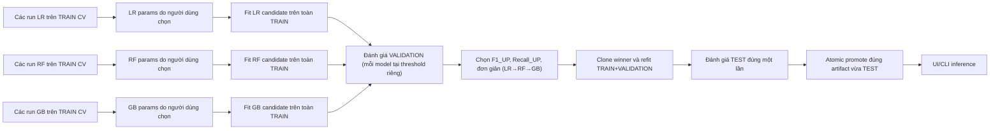

# Giải thích project dự báo xu hướng cổ phiếu HOSE

Tài liệu hiện hành cho protocol ML `v3_recent4_oof_threshold`.

> Trạng thái: artifact và metric đang phục vụ (`models/final_model.pkl`, `models/model_metadata.json`) đã là kết quả v3. Final Model hiện tại là Gradient Boosting và **chưa vượt baseline** trên cả VALIDATION lẫn TEST. Đây là số liệu thật, không phải giả định.

## 1. Bài toán

Project trả lời một câu hỏi phân loại:

```text
Giá đóng cửa của mã tại đúng phiên thị trường chung thứ 5 sau ngày t
có tăng hơn 1% so với giá đóng cửa tại t không?
```

- `UP`: mức tăng **lớn hơn** `1%`.
- `NOT_UP`: không đạt điều kiện trên. Có thể giảm, đi ngang hoặc tăng không quá `1%`.
- `Điểm UP`: score lớp UP do model sinh ra (`predict_proba` của lớp `1`). Đây không phải xác suất chắc thắng, độ chính xác hay mức tăng giá.
- Quyết định: `Điểm UP >= decision_threshold` là `UP`; thấp hơn là `NOT_UP`.

Hai threshold khác vai trò:

```text
UP_THRESHOLD = 0.01        # tạo đáp án thật
DECISION_THRESHOLD         # đổi score thành dự báo UP/NOT_UP
```

Khác với bản trước: `decision_threshold` **không còn cố định 0.5**. Mỗi model tự tối ưu ngưỡng riêng trong lúc CV (xem mục 7). Hằng số `DECISION_THRESHOLD = 0.5` trong `config/settings.py` chỉ là giá trị dự phòng khi model không lưu ngưỡng riêng. Final Model hiện tại lưu `decision_threshold = 0.49`.

## 2. Tạo target đúng phiên t+5

Target được tạo trên clean OHLCV trước khi loại row thiếu feature rolling:

1. Lấy danh sách `trading_date` duy nhất của thị trường.
2. Với ngày `t`, tìm đúng ngày ở vị trí `t+5` trong danh sách đó (`PREDICTION_HORIZON = 5`).
3. Tìm giá của cùng mã tại đúng ngày `t+5`.
4. Nếu mã thiếu giá tại ngày đích, loại row khỏi dataset học; không nhảy sang phiên tiếp theo của riêng mã.
5. Tính `future_return_5d = future_close_5d / close - 1`.
6. Gán `target = 1` khi return lớn hơn `0.01`.

Row thiếu target (NaN) bị loại trước khi ghi `ml_dataset.csv`. Vì vậy ngày lớn nhất trong dataset đã là phiên cuối cùng có nhãn t+5 đầy đủ. Cách này giữ nghĩa "5 phiên thị trường" nhất quán giữa mọi mã.

## 3. Feature

Model dùng 20 feature theo đúng thứ tự trong `config/settings.py::FEATURE_COLUMNS`:

```text
return_1d, return_3d, return_5d, close_open_return,
sma5, sma20, sma50, close_vs_sma20, sma20_vs_sma50,
rsi14, volatility_5d, volatility_20d, price_range,
volume_change_1d, volume_ratio_20, return_10d, return_20d,
dist_high20, dist_low20, month
```

Nhóm ý nghĩa:

- Return: 1, 3, 5, 10, 20 phiên.
- Quan hệ giá: close/open, close/SMA20, SMA20/SMA50.
- SMA: 5, 20, 50.
- RSI14.
- Volatility: 5, 20.
- Biên độ giá.
- Volume change và volume/AVG20.
- Khoảng cách đến high/low 20 phiên.
- Tháng.

Các cột tương lai, target và `label_end_date` không được vào feature.

## 4. Chia dữ liệu theo ngày cuối dataset (rolling)

Ranh giới TRAIN/VALIDATION/TEST không còn là hằng số cứng. Chúng do `services/protocol_dates.py::resolve_protocol_dates()` tính từ ngày cuối cùng của dataset:

```text
test_end_date       = max(trading_date) trong dataset
validation_end_date = test_end_date - TEST_WINDOW_DAYS (94 ngày)
train_end_date      = validation_end_date - VALIDATION_WINDOW_DAYS (274 ngày)
```

```text
TRAIN
  label_end_date <= train_end_date

VALIDATION
  trading_date > train_end_date
  label_end_date <= validation_end_date

TEST
  validation_end_date < trading_date <= test_end_date
```

Với dataset hiện tại, các mốc được resolve thành `train_end = 2025-06-30`, `validation_end = 2026-03-31`, `test_end = 2026-07-03` (trùng hằng số fallback nên nhìn giống bản cũ, nhưng cơ chế đã là rolling).

Fallback về mốc cố định (`source: "fallback_fixed"`) chỉ xảy ra khi dataset rỗng/thiếu `trading_date`, hoặc span dataset ngắn hơn `368` ngày, hoặc `train_end` sẽ làm TRAIN rỗng. Ngược lại `source: "rolling_max_session"`.

Cùng một hàm `resolve_protocol_dates()` được dùng cho cả split thật lẫn mask tính fingerprint, nên hai đường không bao giờ lệch nhau.

Row có feature trước ranh giới nhưng label vượt qua ranh giới bị purge. Vì vậy:

```text
max(TRAIN.label_end_date) < min(VALIDATION.trading_date)
max(VALIDATION.label_end_date) < min(TEST.trading_date)
```

TEST không dùng để tuning hoặc chọn loại model.

## 5. Cross-validation trên TRAIN

CV có **4 fold** expanding-window (`CV_N_SPLITS = 4`) theo danh sách ngày giao dịch duy nhất, dùng `sklearn.TimeSeriesSplit` chạy trên các ngày (không phải trên row):

```text
Fold 1: train cũ       -> gap 5 phiên -> validation kế tiếp
Fold 2: train dài hơn  -> gap 5 phiên -> validation kế tiếp
Fold 3: train dài hơn  -> gap 5 phiên -> validation kế tiếp
Fold 4: train gần hết  -> gap 5 phiên -> validation cuối
```

Chi tiết mỗi fold (`services/time_splitting.py::iter_purged_date_splits`):

1. Chỉ xét ngày giao dịch từ `CV_START_DATE = 2021-01-01` trở đi.
2. Giữ nguyên toàn bộ row cùng một `trading_date` ở cùng phía.
3. Bỏ đúng `CV_GAP_SESSIONS = 5` ngày giao dịch giữa train và validation.
4. Purge: loại mọi train row có `label_end_date >= validation_start`.
5. Fit estimator tạm trên fold-train (clone estimator gốc).
6. Ghi F1_UP, Precision_UP, Recall_UP và dải ngày (`fold_date_ranges`).
7. Bỏ model tạm; không lưu model fold. Fold rỗng → `ValueError`.

Tuning Lab và official pipeline dùng chung `run_cv_metrics()` và `iter_purged_date_splits()`.

## 6. Ý nghĩa metric

Với UP là positive class:

```text
Precision_UP = TP / (TP + FP)
Recall_UP    = TP / (TP + FN)
F1_UP        = 2 * Precision * Recall / (Precision + Recall)
```

- Precision_UP: trong các row model báo UP, tỷ lệ UP thật.
- Recall_UP: trong các row UP thật, tỷ lệ model nhận ra.
- F1_UP: cân bằng Precision và Recall.
- CV F1_UP mean: trung bình F1_UP của 4 fold.
- CV F1_UP std: mức dao động giữa fold; thấp hơn ổn định hơn.

CV F1_UP là chất lượng chung trên nhiều đoạn TRAIN. Điểm UP trên UI là score của một mã tại một ngày. Hai giá trị không cùng ý nghĩa.

## 7. Tuning ba model và chọn ngưỡng OOF

Mỗi lần bấm chạy một cấu hình tạo background job. Tối đa một job chạy trong Flask process (một `threading.Lock` + một `_JOB_THREAD` toàn cục).

Estimator được dựng trong `services/model_tuning.py::build_estimator`:

- Logistic Regression: `Pipeline([StandardScaler, LogisticRegression(class_weight="balanced", max_iter=1000, random_state=42)])`.
- Random Forest: `RandomForestClassifier(class_weight="balanced_subsample", n_jobs=-1, random_state=42)`.
- Gradient Boosting: `GradientBoostingClassifier(random_state=42)`; do không có `class_weight`, cân bằng lớp bằng `sample_weight=compute_sample_weight("balanced", y)` truyền vào lúc `.fit()`.

Chọn ngưỡng quyết định (OOF threshold, out-of-fold) — thay cho ngưỡng cố định 0.5:

1. Gộp (pool) xác suất out-of-fold của cả 4 fold.
2. Quét threshold từ `THRESHOLD_MIN = 0.05` đến `THRESHOLD_MAX = 0.95`, bước `0.01`.
3. Chỉ giữ threshold thỏa cả hai ràng buộc:
   - `predicted_up_ratio <= THRESHOLD_MAX_PREDICTED_UP_RATIO` (0.50) — không được báo UP quá nửa số row.
   - `precision >= tỷ lệ UP thực tế` (precision floor bằng base rate của lớp UP).
4. Chọn threshold tốt nhất theo `(f1, precision, threshold)`.
5. Không threshold nào thỏa → job báo lỗi.

Sau khi chốt threshold, recompute lại F1/precision/recall từng fold tại đúng threshold đó.

Một run chỉ hợp lệ (`_validate_cv_provenance`) khi:

- Đúng 4 entry trong `f1_up_folds` / `precision_up_folds` / `recall_up_folds` / `fold_date_ranges`.
- `0 < decision_threshold < 1`.
- `threshold_constraint_passed` là true.
- `oof_predicted_up_ratio <= 0.50`.
- `oof_precision_up >= oof_up_rate`.

Người dùng tự nhập hyperparameter trong giới hạn của từng estimator (`TUNABLE_PARAM_SCHEMA`), chạy bao nhiêu thử nghiệm tùy nhu cầu, xem CV và tự chốt một run cho mỗi model. Nhãn `Tốt nhất` chỉ gợi ý, không tự thay lựa chọn.

- Logistic Regression: `C > 0`, `solver ∈ {lbfgs, liblinear}`.
- Random Forest: `n_estimators >= 1`, `max_depth` là `None` hoặc số nguyên `>= 1`, `min_samples_leaf >= 1`, `max_features ∈ {sqrt, log2}` hoặc float `(0,1]`.
- Gradient Boosting: `n_estimators >= 1`, `learning_rate ∈ (0,1]`, `max_depth >= 1`, `subsample ∈ (0,1]`.

Mọi run được ghi vào `experiments/tuning_history.csv` (kể cả run lỗi, `status: "error"`). Run sai policy hoặc sai fingerprint không thể chốt cho pipeline hiện tại.

## 8. Từ best config đến Final Model



`tune_models(train)` không tự chạy lại CV. Nó đọc lại metric CV mà Tuning Lab đã tính và lưu cho từng run được chốt (kiểm số fold = 4 và đủ trường bắt buộc), rồi chỉ fit mỗi estimator một lần trên toàn TRAIN. Nó ghi `tuning_results.csv`, `cv_fold_results.csv`, `best_params.json`.

Ba candidate được chọn chỉ bằng VALIDATION (`select_final_model`), mỗi model chấm tại `decision_threshold` riêng của nó:

1. F1_UP cao nhất.
2. Nếu F1_UP bằng nhau, Recall_UP cao nhất.
3. Nếu vẫn bằng, ưu tiên đơn giản: LR (rank 1), rồi RF (rank 2), rồi GB (rank 3).

Sau khi chọn:

1. Clone estimator thắng.
2. Fit lại từ đầu trên TRAIN+VALIDATION (sort theo `trading_date`).
3. Đánh giá đúng model đó trên TEST một lần, tại threshold của artifact.
4. Không refit sau TEST.
5. Atomic replace chính artifact vừa được TEST thành `final_model.pkl` (chỉ sau khi report sinh xong).

## 9. Baseline

Hai baseline được báo cáo trên cả VALIDATION và TEST (`evaluate_baselines`):

- `Always-UP` (`model_id -1`): luôn dự báo UP.
- `Always-NOT_UP` (`model_id -2`): luôn dự báo NOT_UP.

Model vẫn được promote nếu chưa vượt baseline. Có hai cờ baseline riêng:

- `validation_baseline_passed`: `True` nếu không có baseline hoặc F1_UP model được chọn > F1_UP baseline tốt nhất trên VALIDATION.
- `baseline_passed`: `True` nếu F1_UP Final Model > F1_UP Always-UP trên TEST.

Khi không vượt:

```text
baseline_passed = false
baseline_warning = thông báo rõ trên trang đánh giá và trang dự báo
```

Trạng thái hiện tại (số thật trong `model_metadata.json`): Final Model là Gradient Boosting, **fail cả hai**:

- VALIDATION: F1_UP model `0.4727` < Always-UP `0.5087` → `validation_baseline_passed = false`.
- TEST: F1_UP model `0.3865` <= Always-UP `0.4285` → `baseline_passed = false`.

## 10. Artifact và report

`models/final_model.pkl` và `models/model_metadata.json` lưu/ghi rõ:

- Policy version (`v3_recent4_oof_threshold`) và các fingerprint (`content_fingerprint`, `training_content_fingerprint`, `tuning_fingerprint`, `experiment_fingerprint`).
- Feature order (20 feature).
- Target horizon (5), threshold `1%`, decision threshold của model (hiện `0.49`).
- Mốc ngày resolve: `train_end_date`, `validation_end_date`, `test_end_date`, `train_through_date`.
- Best params và CV config (`n_splits: 4, gap_sessions: 5`), `cv_f1_up`.
- `validation_selection_metrics` và `final_test_metrics` (+ `test_metrics` bản tương thích).
- `final_test_baselines` (Always-UP và Always-NOT_UP trên TEST).
- Row counts (`train_rows`, `validation_rows`, `train_validation_rows`, `test_rows`).
- `baseline_passed` / `baseline_warning`, `selection` (kèm `validation_baseline_passed`).
- `test_reused_from_policy` và `test_reuse_disclosure` nếu TEST được tái dùng từ policy trước.

Report tách vai trò (thư mục `reports/`):

- `tuning_results.csv`: CV của best config.
- `cv_fold_results.csv`: metric và dải ngày từng fold.
- `best_params.json`: params đã chốt.
- `model_comparison.csv`: candidates và baselines trên VALIDATION.
- `final_model_evaluation.csv`: Final Model và hai baselines trên TEST.
- `classification_report.csv`: chi tiết Final Model trên TEST.
- `confusion_matrix.csv` / `confusion_matrix.png`: confusion matrix Final Model trên TEST.
- `model_selection_report.txt`, `pipeline_summary.json`, `feature_importance.csv`, `hyperparameter_explanation.md`: phụ trợ.

## 11. Tuning Lab và UI

Tuning Lab (`/tuning`) hiển thị:

- Form nhập hyperparameter cho từng model.
- History từng model (lọc/sắp xếp/phân trang), gồm mean/std và metric từng fold.
- Job nền đang chạy / thành công / thất bại.
- Nút chốt (`/tuning/use-config`) bất kỳ run hợp lệ; gated theo fingerprint khớp và `status == "ok"`. Best CV chỉ là gợi ý.
- Nút chạy official pipeline (`/tuning/run-pipeline`), fetch dữ liệu (`/tuning/fetch-data`) và trang trạng thái fetch.

Trang đánh giá (`/evaluation`) tách ba phần khi policy khớp v3:

1. CV của best config trên TRAIN.
2. Chọn model trên VALIDATION.
3. Final Model và baselines trên TEST.

Nếu `model_metadata.json.policy_version` không khớp `EXPERIMENT_POLICY_VERSION`, trang lùi về view legacy (một bảng `model_comparison.csv`) kèm cảnh báo.

Trang dự báo (`/` và `/compare`) luôn gọi output là `Điểm UP`, hiển thị mốc ngày tham chiếu và 5 phiên dự kiến. `reference_date` là phiên gần nhất của mã trong dữ liệu local (không phải "hôm nay"); `is_stale` cảnh báo khi mã tụt sau phiên mới nhất của toàn dataset. 5 phiên dự kiến được suy ra bằng cách đi tới bỏ cuối tuần. `NOT_UP` không được trình bày thành "giảm". Mỗi lần so sánh tối đa 2 mã; mỗi mã cần tối thiểu `MIN_TRADING_DAYS = 250` phiên.

Ứng dụng Flask chạy loopback (`127.0.0.1:5000`), một người dùng, không có xác thực.

## 12. Lock và rollback

- Pipeline bọc toàn bộ run bằng `experiments/pipeline.lock`; từ chối chạy nếu process pipeline khác đang giữ lock.
- TEST lock được kiểm **hai lần**: trước cleanup (trên fingerprint in-memory) và sau khi ghi `ml_dataset.csv` (trên fingerprint đã ghi). Ghi TEST lock (`test_evaluation_lock.json`) chỉ sau khi model, metadata và report hoàn tất.
- Kiểm đủ ba run do người dùng chọn, policy và fingerprint trước cleanup.
- Nếu tái dùng TEST khác policy: archive release hiện tại (`models/`, `reports/`, DB, lock) vào `experiments/archive/releases/<timestamp>/` **trước** cleanup.
- Sau khi ghi dataset, recompute fingerprint và assert khớp bản in-memory; lệch → `RuntimeError` "Fingerprint thay đổi sau khi ghi ml_dataset.csv."
- Refit và TEST chạy trong bộ nhớ.
- `final_model.pkl` chỉ được atomic replace sau khi report sinh thành công; metadata ghi qua temp file rồi `os.replace`.
- Tái dùng TEST xuyên policy chỉ được phép qua cờ CLI `--acknowledge-prior-test-use`.

## 13. Lệnh chạy

```powershell
.\.venv\Scripts\Activate.ps1
python scripts/refresh_data.py
python app.py
```

Trên `/tuning`, thử và tự chọn một cấu hình cho LR, RF và GB. Sau khi đủ ba lựa chọn, chạy official pipeline từ UI hoặc:

```powershell
python scripts/run_pipeline.py
```

Chỉ tune (không chọn/promote Final Model):

```powershell
python scripts/train_tune_models.py
```

Prediction smoke test:

```powershell
python scripts/predict_stock.py --symbol FPT
```

## 14. Giới hạn trình bày trong báo cáo

- Protocol v3 dùng dữ liệu hiện có; ranh giới split resolve từ ngày cuối dataset.
- Giai đoạn TEST từng thuộc protocol trước (`test_reused_from_policy = v2_date_purged_fixed_050`); không tuyên bố hoàn toàn chưa từng được quan sát.
- Final Model hiện tại **chưa vượt baseline Always-UP** trên VALIDATION lẫn TEST; phải nêu đúng trạng thái này khi báo cáo.
- Kết quả chỉ phục vụ nghiên cứu/học tập, không phải khuyến nghị đầu tư.
