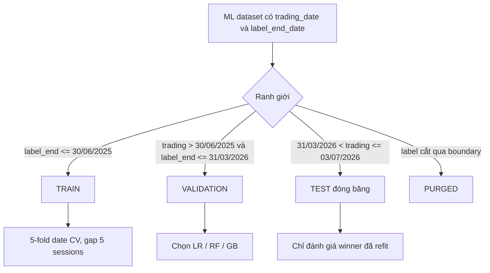
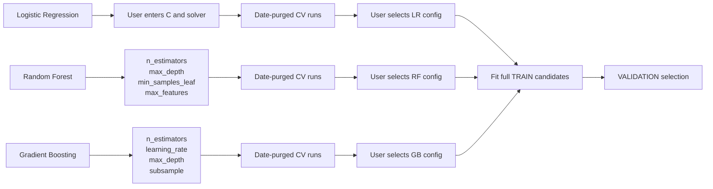
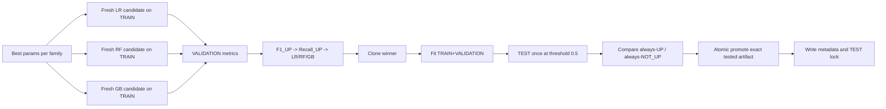

# Sơ đồ kiến trúc hệ thống HOSE ML - protocol v2

## 1. Kiến trúc tổng thể

```mermaid
flowchart LR
    A["Raw HOSE OHLCV"] --> B["Preprocessing"]
    B --> C["Clean OHLCV"]
    C --> D["20 technical features"]
    C --> E["Exact common-market t+5 labels"]
    D --> F["ML dataset"]
    E --> F
    F --> G["Fixed TRAIN / VALIDATION / TEST"]
    G --> H["Tuning Lab: user-entered configs"]
    H --> I["Manual choice LR / RF / GB"]
    I --> J["TRAIN candidates"]
    J --> K["VALIDATION selection"]
    K --> L["TRAIN+VALIDATION refit"]
    L --> M["One-time TEST"]
    M --> N["Atomic final_model.pkl + metadata"]
    N --> O["Flask / CLI inference"]
    O --> P["UP / NOT_UP at score 0.5"]

    F --> Q["CSV reports"]
    Q --> R["SQLite sync"]
    O --> R
```

## 2. Ranh giới dữ liệu

## 3. Ba pipeline tuning

Luồng giống nhau; hộp hyperparameter là phần khác nhau bắt buộc làm nổi bật.

Chi tiết giới hạn tham số nằm tại [Giải thích project](GIAI_THICH_PROJECT.md#7-tuning-ba-model).

## 4. Final Model lifecycle

## 5. Inference

## 6. Report contract

| File | Nội dung |
|---|---|
| `tuning_results.csv` | CV best config trên TRAIN |
| `cv_fold_results.csv` | Metric và dải ngày từng fold |
| `model_comparison.csv` | Ba candidates và baselines trên VALIDATION |
| `final_model_evaluation.csv` | Final Model và hai baselines trên TEST |
| `model_metadata.json` | Policy, fingerprint, feature order, Validation/TEST metrics, baseline status |

Artifact hiện có vẫn là legacy cho tới khi Tuning Lab đạt `12/12` cho cả ba model và pipeline v2 hoàn tất. Không có metric v2 được ghi cứng trong tài liệu này.
