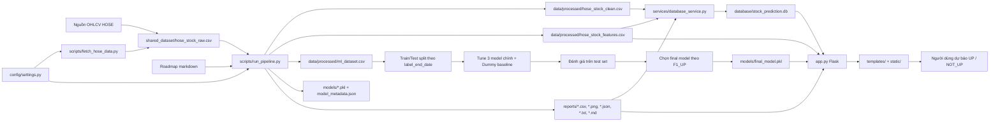
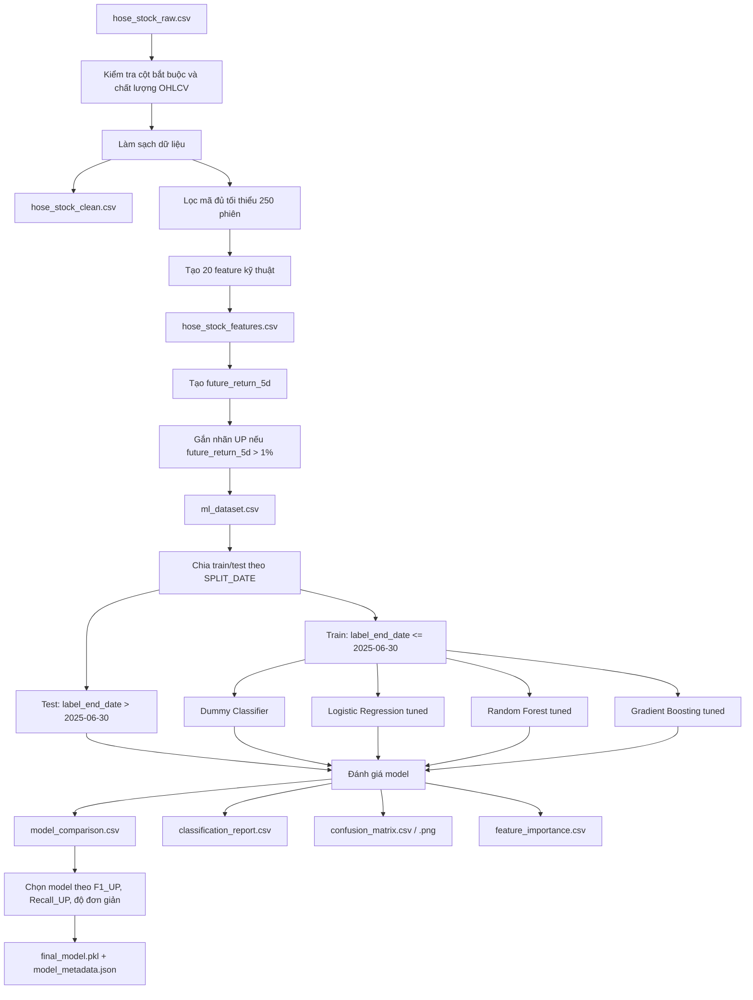
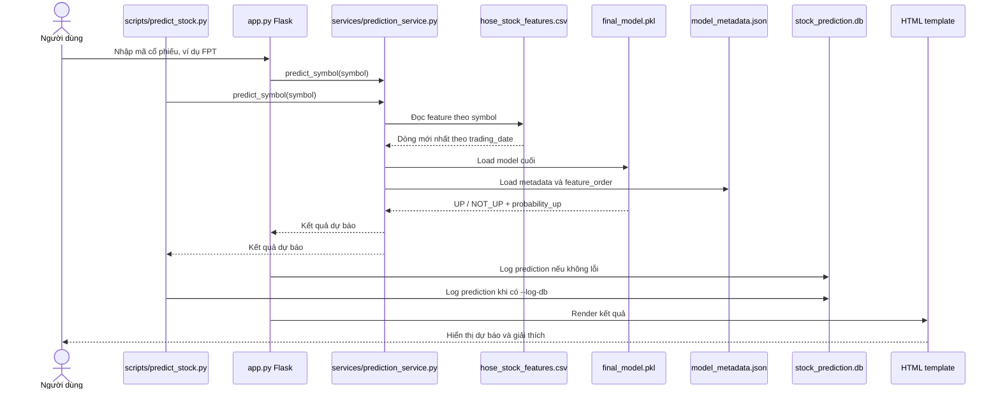

# Sơ đồ kiến trúc hệ thống dự báo xu hướng cổ phiếu HOSE

Tài liệu này mô tả kiến trúc theo code hiện tại của project. CSV vẫn là artefact chính của pipeline, còn SQLite được dùng để sync dữ liệu/report và lưu lịch sử dự báo.

## 1. Kiến trúc tổng thể hiện tại



### Cách đọc sơ đồ

- `hose_stock_raw.csv` là dữ liệu OHLCV gốc nằm ngoài repo trong shared dataset.
- `scripts/run_pipeline.py` là luồng chính: đọc roadmap, kiểm tra dataset, clean, tạo feature, tạo label, split, tune, evaluate, chọn model, ghi report và sync database.
- `models/final_model.pkl` và `models/model_metadata.json` là artefact web/CLI dùng để dự báo.
- `database/stock_prediction.db` được tạo từ `database/init_db.sql` và sync qua `services/database_service.py`.
- `templates/` và `static/` là giao diện Flask.

## 2. Pipeline xử lý dữ liệu và train model



### Ý chính

Pipeline không train trực tiếp từ raw cho web. Nó tạo các tầng artefact rõ ràng:

```text
raw data
-> cleaned data
-> feature data
-> ML dataset có target
-> train/test split theo label_end_date
-> train/tune/evaluate
-> final_model.pkl
-> reports
-> SQLite sync
```

Theo report hiện tại:

```text
Train: 417,806 dòng; 2019-10-23 đến 2025-06-23; label_end_date tối đa 2025-06-30
Test : 95,022 dòng; 2025-03-03 đến 2026-07-03; label_end_date tối thiểu 2025-07-01
Final model: Gradient Boosting; TEST F1_UP 0.5053; Recall_UP 0.9176
```

## 3. Luồng dự báo trên web/CLI



## 4. SQLite database hiện tại

SQLite đã có trong code hiện tại:

- `database/init_db.sql`: định nghĩa schema.
- `database/db_connection.py`: mở connection và chạy schema.
- `database/init_db.py`: khởi tạo database và sync toàn bộ dữ liệu/report.
- `services/database_service.py`: sync raw/clean/features/tuning/evaluation và log prediction.

Các bảng chính:

| Bảng | Vai trò |
|---|---|
| `raw_prices` | Dữ liệu OHLCV thô |
| `clean_prices` | Dữ liệu sau làm sạch |
| `features` | Feature kỹ thuật theo mã/ngày |
| `tuning_results` | Kết quả tuning model |
| `model_evaluations` | Kết quả đánh giá model |
| `predictions` | Lịch sử dự báo từ Flask/CLI |

## 5. Các thành phần chính

| Thành phần | Vai trò |
|---|---|
| `config/settings.py` | Cấu hình đường dẫn, feature, split date, threshold, model |
| `scripts/fetch_hose_data.py` | Cập nhật dữ liệu OHLCV bằng `vnstock` |
| `scripts/run_pipeline.py` | Pipeline đầy đủ từ raw đến model/report/database |
| `services/preprocessing.py` | Kiểm tra và làm sạch dữ liệu |
| `services/feature_engineering.py` | Tạo feature, label và train/test split |
| `services/model_tuning.py` | Tune Logistic Regression, Random Forest, Gradient Boosting |
| `services/model_evaluation.py` | Đánh giá, chọn final model, ghi reports |
| `services/prediction_service.py` | Load feature/model/metadata và dự báo một symbol |
| `services/database_service.py` | Sync SQLite và log lịch sử dự báo |
| `app.py` | Flask backend cho web demo |
| `docs/diagrams/` | Các sơ đồ HTML export để xem trực quan |

## 6. Sơ đồ một câu

```text
vnstock/shared raw CSV
-> clean
-> feature
-> label UP/NOT_UP
-> split theo thời gian
-> tune/evaluate/select Gradient Boosting trên TEST F1_UP
-> ghi models/reports
-> sync SQLite
-> Flask/CLI dùng final_model.pkl để dự báo và log prediction
```
