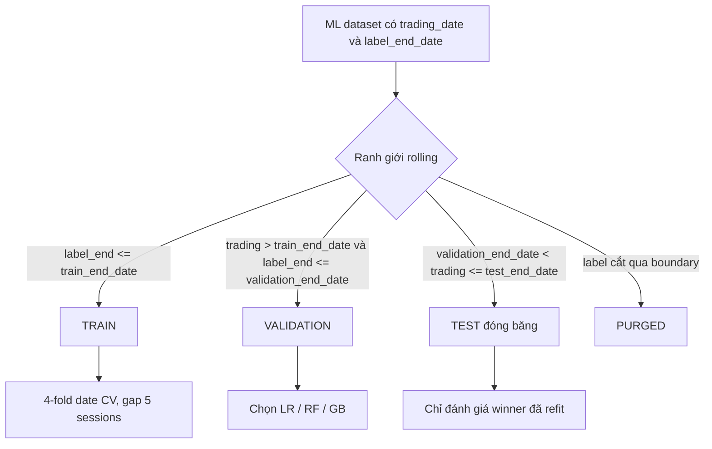
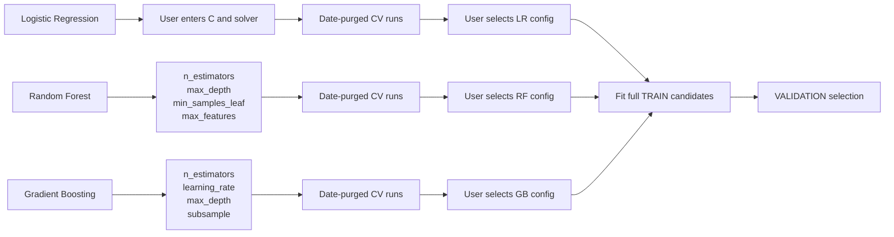
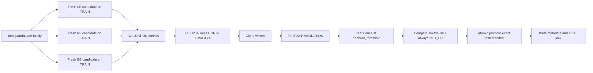
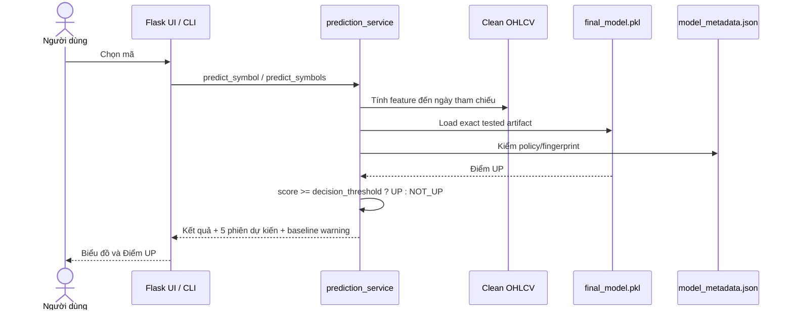
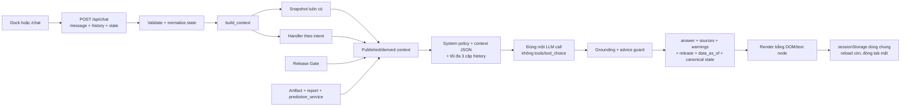

# Sơ đồ kiến trúc hệ thống HOSE ML - policy `rolling_recent_cv_oof_threshold`

## 1. Kiến trúc tổng thể

```mermaid
flowchart LR
    A["Raw HOSE OHLCV"] --> B["Preprocessing"]
    B --> C["Clean OHLCV"]
    C --> D["20 technical features"]
    C --> E["Exact common-market t+5 labels"]
    D --> F["ML dataset"]
    E --> F
    F --> G["Rolling TRAIN / VALIDATION / TEST"]
    G --> H["Tuning Lab: user-entered configs"]
    H --> I["Manual choice LR / RF / GB"]
    I --> J["TRAIN candidates"]
    J --> K["VALIDATION selection"]
    K --> L["TRAIN+VALIDATION refit"]
    L --> M["One-time TEST"]
    M --> N["Atomic final_model.pkl + metadata"]
    N --> O["Flask / CLI inference"]
    O --> P["UP / NOT_UP at decision_threshold"]

    F --> Q["CSV reports"]
    Q --> O
```

## 2. Ranh giới dữ liệu

## 3. Ba pipeline tuning

Luồng giống nhau; hộp hyperparameter là phần khác nhau bắt buộc làm nổi bật.

Chi tiết giới hạn tham số nằm tại [Giải thích project](GIAI_THICH_PROJECT.md#7-tuning-ba-model).

## 4. Final Model lifecycle

## 5. Inference

## 6. Chatbot structured context injection (SCI)

Context chỉ chứa dữ liệu published/derived đã rút gọn; không gửi raw CSV, code hoặc pickle tới provider. Data/model cập nhật làm chữ ký snapshot đổi và cache tự vô hiệu. Release identity phải đồng nhất giữa mọi context block. Server cho phép nhận định xu hướng khớp UP/NOT_UP nhưng chặn khuyến nghị mua/bán trực tiếp và số không có trong context.

## 7. Report contract

| File | Nội dung |
|---|---|
| `tuning_results.csv` | CV best config trên TRAIN |
| `cv_fold_results.csv` | Metric và dải ngày từng fold |
| `model_comparison.csv` | Ba candidates và baselines trên VALIDATION |
| `final_model_evaluation.csv` | Final Model và hai baselines trên TEST |
| `model_metadata.json` | Policy, fingerprint, feature order, Validation/TEST metrics, baseline status |

Mốc TRAIN/VALIDATION/TEST không ghi cứng trong tài liệu này: chúng do `services/protocol_dates.resolve_protocol_dates` suy ra từ dataset (rolling) và được ghi lại trong `model_metadata.json` dưới các key `split_date` (bằng `train_end_date`), `train_end_date`, `validation_end_date`, `test_end_date`. Tương tự, `decision_threshold` lấy từ artifact tuning rồi ghi vào metadata, không phải hằng số 0.5.

Artifact đang phục vụ (`models/final_model.pkl`) hiện mang `policy_id = legacy_pre_validation_baseline_gate`, tức được publish trước khi policy `rolling_recent_cv_oof_threshold` có hiệu lực. `prediction_service` phát hiện lệch này và trả `baseline_warning` cho UI. Số liệu cụ thể tra trực tiếp trong `models/model_metadata.json` và `reports/`, không ghi lại ở đây để tránh lệch.
